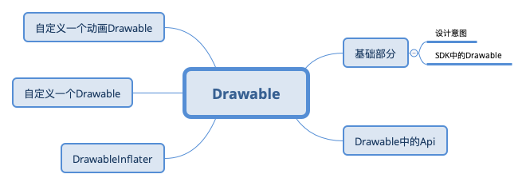
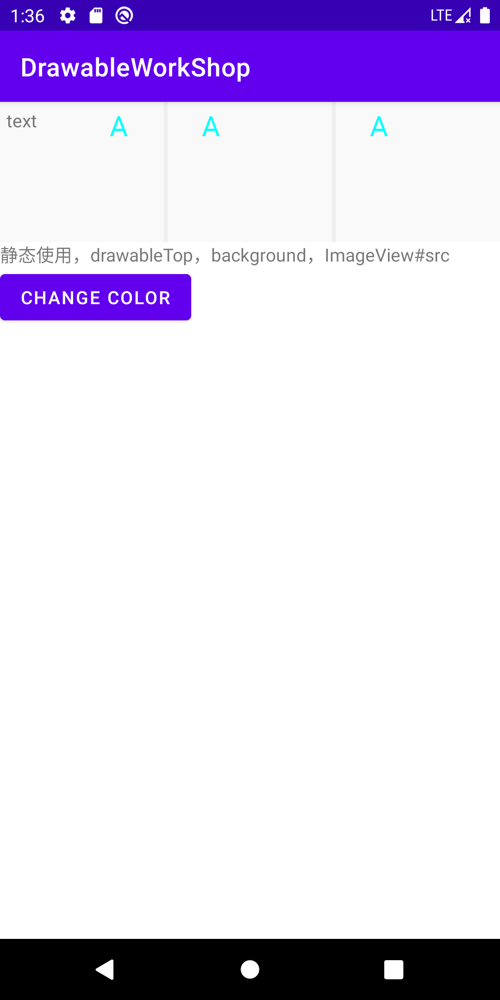
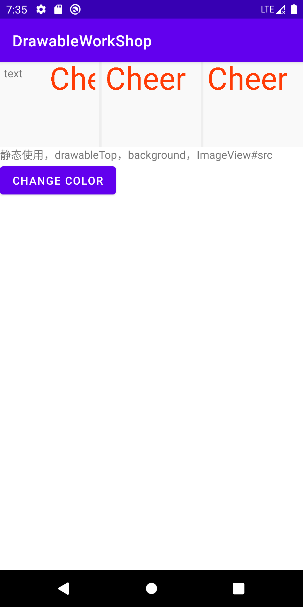
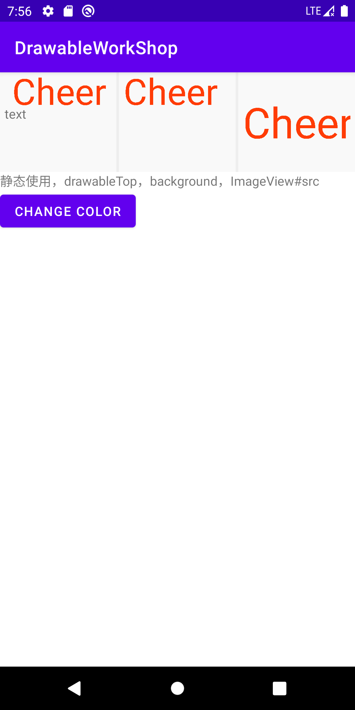
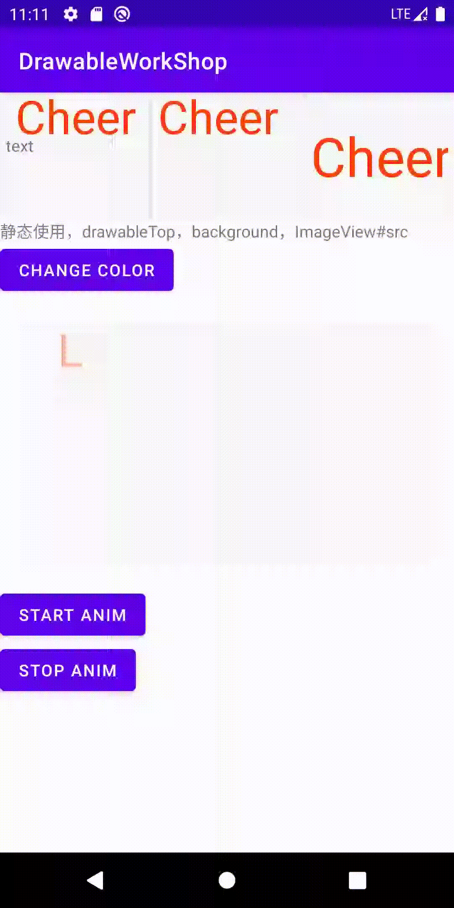
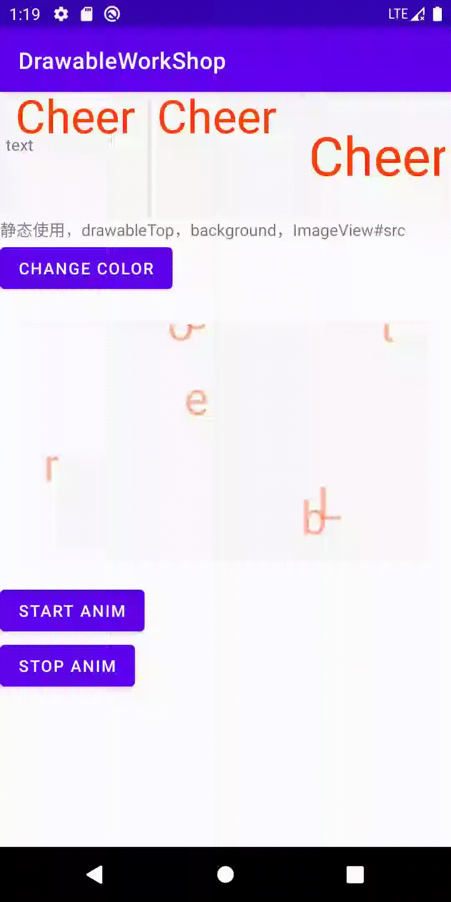

# 三思系列：重新认识Drawable

## 前言

[关于三思系列](https://github.com/leobert-lan/Blog/blob/main/info/%E5%85%B3%E4%BA%8E%E4%B8%89%E6%80%9D%E7%B3%BB%E5%88%97.md)

前一段时间看到宏洋公众号推送了一篇关于splash页面动效的文章，具体为：将一个英文单词拆分为多个字母，散落在屏幕中，然后按照一定的路径回归，最终展示一段流光效果，完成splash页面。

当时文章中提到的做法是自定义View的实现。当时脑海中灵光一闪，感觉还是用Drawable来干这个事情更加合适。

记忆中，我曾经整理过一篇Drawable基础内容的文章，可惜丢失了，在开始干这件事情之前，我们把这一块内容再完整的梳理一遍。

这篇文章会比较长，先给出导图

``


## Drawable的设计意图

> A Drawable is a general abstraction for "something that can be drawn."  Most often you will deal with Drawable as the type of resource retrieved for drawing things to the screen; the Drawable class provides a generic API for dealing with an underlying visual resource that may take a variety of forms. Unlike a View, a Drawable does not have any facility to receive events or otherwise interact with the user.

这是SDK文档中的内容，大致含义呢：drawable是对于"**可以被绘制的内容**"的**抽象**。 多数情况下，我们将获取的资源作为Drawable绘制在屏幕上，
Drawable类提供了一个通用API，用于处理可能采用多种类型的底层可视资源。 不像View，Drawable**没有**任何接收事件或以其他方式与用户交互的功能。

为了简化绘制，Drawable中为使用者提供了一定的机制操作绘制：

> * The {@link #setBounds} method <var>must</var> be called to tell the
    > Drawable where it is drawn and how large it should be. All Drawables
    > should respect the requested size, often simply by scaling their
    > imagery. A client can find the preferred size for some Drawables with
    > the {@link #getIntrinsicHeight} and {@link #getIntrinsicWidth} methods.
>
> * The {@link #getPadding} method can return from some Drawables
    > information about how to frame content that is placed inside of them.
    > For example, a Drawable that is intended to be the frame for a button
    > widget would need to return padding that correctly places the label
    > inside of itself.
>
> * The {@link #setState} method allows the client to tell the Drawable
    > in which state it is to be drawn, such as "focused", "selected", etc.
    > Some drawables may modify their imagery based on the selected state.
>
> * The {@link #setLevel} method allows the client to supply a single
    > continuous controller that can modify the Drawable is displayed, such as
    > a battery level or progress level. Some drawables may modify their
    > imagery based on the current level.
>
> * A Drawable can perform animations by calling back to its client
    > through the {@link Callback} interface. All clients should support this
    > interface (via {@link #setCallback}) so that animations will work. A
    > simple way to do this is through the system facilities such as
    > {@link android.view.View#setBackground(Drawable)} and
    > {@link android.widget.ImageView}.


继续简要翻译一下重要内容

* setBounds 方法必须被调用，它告知了Drawable应该被绘制的位置和大小
* getPadding 方法可以获知一些Drawable绘制时的内边距信息
* setState 方法允许使用者告知Drawable应当在哪些状态时绘制，例如获取了焦点，被选中等
* setLevel 方法允许调用者提供一个连续的控制器，可以修改显示的可绘制内容， 例如电池电量或进度。一些Drawable可能会根据当前的level改变其图像
* Drawable可以展现动画，通过设置Callback接口回调给他的使用者，所有的使用者，需要通过 setCallback方法提供回调函数支持以让动画工作。一个简便方式是通过一些系统设施例如：View#setBackground 和
  ImageView

> 注：Drawable展现动画部分，这里翻译的比较晦涩，具体细节见：Drawable Api概览

小结：Android SDK中抽象了Drawable体系，不同于View体系，它仅负责描述可绘制的内容，不可进行用户交互，其子类将描述各类可绘制内容的特性。

## SDK中的Drawable子类概览

> 注：经过多次思考，我最终把这一段的草稿删除了，这部分体系实在是太大，浅写无异于copy官方文档，深挖就会影响文章关注的重点。
> 如果对系统中提供的Drawable子类感兴趣的，建议深入源码看一下。

## Drawable Api概览

在开头的设计意图探索中，我们已经阅读了几个关键API：`setBound`，`getPadding`，`setState`，`setLevel`，`setCallback`的信息

还有`getBound`，`copyBound`等获取边界信息的API，RippleDrawable和一些自定义的Drawable还覆写了`getDirtyBounds`，用以获取它可能涉及到的范围边界

横向的方向相关：`setLayoutDirection`，`getLayoutDirection`，`onLayoutDirectionChanged`

透明度相关：`setAlpha`，`getAlpha`

着色和颜色filter相关：`setColorFilter`，`getColorFilter`，`clearColorFilter`，
`setTint`，`setTintList`，`setTintMode`，`setTintBlendMode`

尺寸测量：`getIntrinsicWidth`，`getIntrinsicHeight`，`getMinimumWidth`，`getMinimumHeight`
当作为背景使用时，getMinimumXXX用于告知View建议使用的最小宽高。getIntrinsicXXX是获取一个Drawable的内在的、固有的宽高，这个值和设备屏幕密度是有关系的。

自我独立：`mutate`，和缓存机制有关，调用得到一个新的Drawable，这样自己的状态就不会影响到其他使用处。

重绘相关：`setCallback(@Nullable Callback cb)`，`getCallback()`，`invalidateSelf()`，
`scheduleSelf(@NonNull Runnable what, long when)`，`unscheduleSelf(@NonNull Runnable what)`

上面我们提到这一组API会详细说一下。以AnimationDrawable为例，这是一个动画Drawable，

```java
class AnimationDrawable {
    private void setFrame(int frame, boolean unschedule, boolean animate) {
        if (frame >= mAnimationState.getChildCount()) {
            return;
        }
        mAnimating = animate;
        mCurFrame = frame;
        selectDrawable(frame);
        if (unschedule || animate) {
            unscheduleSelf(this);
        }
        if (animate) {
            // Unscheduling may have clobbered these values; restore them
            mCurFrame = frame;
            mRunning = true;
            scheduleSelf(this, SystemClock.uptimeMillis() + mAnimationState.mDurations[frame]);
        }
    }
}
```

设置某一帧之后，如果是使用动画，则会调用scheduleSelf，时间戳是下一帧应该出现的时间戳。

```java
class Drawable {
    public void scheduleSelf(@NonNull Runnable what, long when) {
        final Callback callback = getCallback();
        if (callback != null) {
            callback.scheduleDrawable(this, what, when);
        }
    }
}
```

如果存在Callback，则调用Callback#scheduleDrawable。

以View的代码为例

```java
class View {
    public void scheduleDrawable(@NonNull Drawable who, @NonNull Runnable what, long when) {
        if (verifyDrawable(who) && what != null) {
            final long delay = when - SystemClock.uptimeMillis();
            if (mAttachInfo != null) {
                mAttachInfo.mViewRootImpl.mChoreographer.postCallbackDelayed(
                        Choreographer.CALLBACK_ANIMATION, what, who,
                        Choreographer.subtractFrameDelay(delay));
            } else {
                // Postpone the runnable until we know
                // on which thread it needs to run.
                getRunQueue().postDelayed(what, delay);
            }
        }
    }
}
```

很简单，验证合法性之后定时执行Runnable，Runnable的内容：

```java
class AnimationDrawable {
    public void run() {
        nextFrame(false);
    }

    private void nextFrame(boolean unschedule) {
        int nextFrame = mCurFrame + 1;
        final int numFrames = mAnimationState.getChildCount();
        final boolean isLastFrame = mAnimationState.mOneShot && nextFrame >= (numFrames - 1);

        // Loop if necessary. One-shot animations should never hit this case.
        if (!mAnimationState.mOneShot && nextFrame >= numFrames) {
            nextFrame = 0;
        }

        setFrame(nextFrame, unschedule, !isLastFrame);
    }
}
```

显示下一帧，逻辑非常清晰，不再进行解析。

> 小结: 这一段我们对Drawable的API进行了简单的梳理，略去了大量关于创建的API以及和开发不太紧密的API，完成了一次概览。
> 更完善的认知需要再仔细研读源码内容，限于篇幅不再展开。

## DrawableInflater

顾名思义，这是一个Drawable加载器，和LayoutInflater类似，从一种满足特定语法的语法式中解析出实例对象，显然，在Android中它用来处理xml语法的drawable资源文件。

看一下文档：

```java
/**
 * Instantiates a drawable XML file into its corresponding
 * {@link android.graphics.drawable.Drawable} objects.
 * <p>
 * For performance reasons, inflation relies heavily on pre-processing of
 * XML files that is done at build time. Therefore, it is not currently possible
 * to use this inflater with an XmlPullParser over a plain XML file at runtime;
 * it only works with an XmlPullParser returned from a compiled resource (R.
 * <em>something</em> file.)
 *
 * @hide Pending API finalization.
 */
```

需要注意，从性能角度上，这种创建严重依赖于构建时的预处理，因此，目前不可能利用它和 **XmlPullParser** 一起 **在运行时解析一个xml文件** 并创建对象实例 只适用于那些已经在资源编译阶段返回的XmlPullParser

我们知道，一个受检的xml document，会被解析为语法树，得到树中的标签节点和属性信息。

我们阅读DrawableInflater的代码，有两段关于创建Drawable具体实例的内容，这是根据tag创建实例的代码

```java
class DrawableInflater {
    private Drawable inflateFromTag(@NonNull String name) {
        switch (name) {
            case "selector":
                return new StateListDrawable();
            case "animated-selector":
                return new AnimatedStateListDrawable();
            case "level-list":
                return new LevelListDrawable();
            case "layer-list":
                return new LayerDrawable();
            case "transition":
                return new TransitionDrawable();
            case "ripple":
                return new RippleDrawable();
            case "adaptive-icon":
                return new AdaptiveIconDrawable();
            case "color":
                return new ColorDrawable();
            case "shape":
                return new GradientDrawable();
            case "vector":
                return new VectorDrawable();
            case "animated-vector":
                return new AnimatedVectorDrawable();
            case "scale":
                return new ScaleDrawable();
            case "clip":
                return new ClipDrawable();
            case "rotate":
                return new RotateDrawable();
            case "animated-rotate":
                return new AnimatedRotateDrawable();
            case "animation-list":
                return new AnimationDrawable();
            case "inset":
                return new InsetDrawable();
            case "bitmap":
                return new BitmapDrawable();
            case "nine-patch":
                return new NinePatchDrawable();
            case "animated-image":
                return new AnimatedImageDrawable();
            default:
                return null;
        }
    }
}
```

如果您已经在第二小节自行对Drawable的子类进行了概览，应该对这些内容不陌生了。

以Android项目模板为例，工程会创建一个启动图标：

```xml

<vector xmlns:android="http://schemas.android.com/apk/res/android"
        xmlns:aapt="http://schemas.android.com/aapt"
        android:width="108dp"
        android:height="108dp"
        android:viewportWidth="108"
        android:viewportHeight="108">
    <path
        android:pathData="M31,63.928c0,0 6.4,-11 12.1,-13.1c7.2,-2.6 26,-1.4 26,-1.4l38.1,38.1L107,108.928l-32,-1L31,63.928z">
        <aapt:attr name="android:fillColor">
            <gradient
                android:endX="85.84757"
                android:endY="92.4963"
                android:startX="42.9492"
                android:startY="49.59793"
                android:type="linear">
                <item
                    android:color="#44000000"
                    android:offset="0.0"/>
                <item
                    android:color="#00000000"
                    android:offset="1.0"/>
            </gradient>
        </aapt:attr>
    </path>
    <path
        android:fillColor="#FFFFFF"
        android:fillType="nonZero"
        android:pathData="M65.3,45.828l3.8,-6.6c0.2,-0.4 0.1,-0.9 -0.3,-1.1c-0.4,-0.2 -0.9,-0.1 -1.1,0.3l-3.9,6.7c-6.3,-2.8 -13.4,-2.8 -19.7,0l-3.9,-6.7c-0.2,-0.4 -0.7,-0.5 -1.1,-0.3C38.8,38.328 38.7,38.828 38.9,39.228l3.8,6.6C36.2,49.428 31.7,56.028 31,63.928h46C76.3,56.028 71.8,49.428 65.3,45.828zM43.4,57.328c-0.8,0 -1.5,-0.5 -1.8,-1.2c-0.3,-0.7 -0.1,-1.5 0.4,-2.1c0.5,-0.5 1.4,-0.7 2.1,-0.4c0.7,0.3 1.2,1 1.2,1.8C45.3,56.528 44.5,57.328 43.4,57.328L43.4,57.328zM64.6,57.328c-0.8,0 -1.5,-0.5 -1.8,-1.2s-0.1,-1.5 0.4,-2.1c0.5,-0.5 1.4,-0.7 2.1,-0.4c0.7,0.3 1.2,1 1.2,1.8C66.5,56.528 65.6,57.328 64.6,57.328L64.6,57.328z"
        android:strokeWidth="1"
        android:strokeColor="#00000000"/>
</vector>
```

其实就是机器人头的图标，它会被加载为`VectorDrawable`

我们反推一下，调用者为：

```java
class DrawableInflater {
    @NonNull
    public Drawable inflateFromXml(@NonNull String name, @NonNull XmlPullParser parser,
                                   @NonNull AttributeSet attrs, @Nullable Theme theme)
            throws XmlPullParserException, IOException {
        return inflateFromXmlForDensity(name, parser, attrs, 0, theme);
    }


    @NonNull
    Drawable inflateFromXmlForDensity(@NonNull String name, @NonNull XmlPullParser parser,
                                      @NonNull AttributeSet attrs, int density, @Nullable Theme theme)
            throws XmlPullParserException, IOException {
        // Inner classes must be referenced as Outer$Inner, but XML tag names
        // can't contain $, so the <drawable> tag allows developers to specify
        // the class in an attribute. We'll still run it through inflateFromTag
        // to stay consistent with how LayoutInflater works.
        if (name.equals("drawable")) {
            name = attrs.getAttributeValue(null, "class");
            if (name == null) {
                throw new InflateException("<drawable> tag must specify class attribute");
            }
        }

        //注意这里 --1
        Drawable drawable = inflateFromTag(name);
        if (drawable == null) {
            //注意这里 --2
            drawable = inflateFromClass(name);
        }
        drawable.setSrcDensityOverride(density);
        //注意这里 --3
        drawable.inflate(mRes, parser, attrs, theme);
        return drawable;
    }
}
```

上面标记了3处注意点， 第一处即为内置的顶层drawable创建

第二处我们稍后再看

第三处将parser，属性和主题交给生成的Drawable继续解析。不同的Drawable子类按照自身特性实现自己的解析需求。

以`LevelListDrawable`为例，我们知道它内部还可以添加Drawable作为不同的level，这是通过递归调用解析创建实现的， 最终追溯源码至Drawable

```java
public class LevelListDrawable {
    private void inflateChildElements(Resources r, XmlPullParser parser, AttributeSet attrs,
                                      Theme theme) throws XmlPullParserException, IOException {
        //略
        while ((type = parser.next()) != XmlPullParser.END_DOCUMENT
                && ((depth = parser.getDepth()) >= innerDepth
                || type != XmlPullParser.END_TAG)) {
            //略

            Drawable dr;
            if (drawableRes != 0) {
                dr = r.getDrawable(drawableRes, theme);
            } else {
                //略
                //注意此处
                dr = Drawable.createFromXmlInner(r, parser, attrs, theme);
            }
            mLevelListState.addLevel(low, high, dr);
        }
        onLevelChange(getLevel());
    }
}


public class Drawable {

    public static Drawable createFromXmlInner(@NonNull Resources r, @NonNull XmlPullParser parser,
                                              @NonNull AttributeSet attrs, @Nullable Theme theme)
            throws XmlPullParserException, IOException {
        return createFromXmlInnerForDensity(r, parser, attrs, 0, theme);
    }

    @NonNull
    static Drawable createFromXmlInnerForDensity(@NonNull Resources r,
                                                 @NonNull XmlPullParser parser, @NonNull AttributeSet attrs, int density,
                                                 @Nullable Theme theme) throws XmlPullParserException, IOException {
        return r.getDrawableInflater().inflateFromXmlForDensity(parser.getName(), parser, attrs,
                density, theme);
    }
}
```

我们再看第二处，当特定的tag未被匹配时，会使用反射方式尝试创建Drawable：

```java
class DrawableInflater {
    @NonNull
    private Drawable inflateFromClass(@NonNull String className) {
        try {
            Constructor<? extends Drawable> constructor;
            synchronized (CONSTRUCTOR_MAP) {
                constructor = CONSTRUCTOR_MAP.get(className);
                if (constructor == null) {
                    final Class<? extends Drawable> clazz =
                            mClassLoader.loadClass(className).asSubclass(Drawable.class);
                    constructor = clazz.getConstructor();
                    CONSTRUCTOR_MAP.put(className, constructor);
                }
            }
            return constructor.newInstance();
        }
        //略
        catch (XXX e) {
        }
    }
}
```

> Custom drawables
>
> All versions of Android allow the Drawable class to be extended and used at run time in place
> of framework-provided drawable classes. Starting in API 24, custom drawables classes may also be used in XML.
> Note: Custom drawable classes are only accessible from within
> your application package. Other applications will not be able to load them.

文档中有这样一段话，自定义的Drawable一直是可行的，但仅Api>=24时才能够用XML定义这样的资源。虽然没有仔细追溯版本源码，但应该和此处有关。


> 小结：我们简单阅读了DrawableInflater的源码，了解了Android如何从xml资源得到Drawable对象。需要注意的是，我们没有阅读Resource#getDrawable
> 的相关源码，这一块内容也很有意思，建议读者有时间自行阅读下。

## 自定义一个Drawable

终于来到这个环节了，为了更好的进行这个环节，我们新建一个WorkShop项目，我会按照文章中每一个小目标提出的一个小目标建立提交。
[DrawableWorkShop](https://github.com/leobert-lan/DrawableWorkShop)

### version 1 一个能绘制的自定义Drawable

这里我们尽可能的简单，目标就是绘制一个字母，先定义类：

```kotlin
class LetterDrawable : Drawable() {
    val tag = "LetterDrawable"

    var letter: Char = 'A'

    val paint = Paint().apply {
        textSize = 60f
        color = Color.CYAN
    }

    override fun draw(canvas: Canvas) {
        Log.d(tag, "on draw")
        canvas.drawText(letter.toString(), 60f, 60f, paint)
    }

    override fun setAlpha(alpha: Int) {
        //ignore
    }

    override fun setColorFilter(colorFilter: ColorFilter?) {
        //ignore
    }

    override fun getOpacity(): Int {
        return PixelFormat.TRANSLUCENT
    }
}
```

字号字色，绘制字母的位置和内容都直接写死，

定义资源：

```xml
<?xml version="1.0" encoding="utf-8"?>
<osp.leobert.android.drawableworkshop.drawable.LetterDrawable
    xmlns:android="http://schemas.android.com/apk/res/android"
>

</osp.leobert.android.drawableworkshop.drawable.LetterDrawable>
```

直接使用：得到结果：

``



### version 2 支持颜色和字号等可配

我们将单个字符改为String，添加color和textSize成员变量，并将改动设置到paint

添加属性定义：

```xml

<resources xmlns:tools="http://schemas.android.com/tools">

    <declare-styleable name="letter_drawable">
        <attr name="android:text" format="string|reference"/>
        <attr name="color" format="color|reference"/>
        <attr name="android:textSize" format="dimension|reference"/>

    </declare-styleable>

</resources>
```

这样我们就可以进行资源配置和解析

按照我们之前阅读的代码，我们需要覆写`inflate`以实现属性解析

```kotlin
class LetterDrawable {
    override fun inflate(
        r: Resources,
        parser: XmlPullParser,
        attrs: AttributeSet,
        theme: Resources.Theme?
    ) {
        super.inflate(r, parser, attrs, theme)
        val a: TypedArray = obtainAttributes(r, theme, attrs, R.styleable.letter_drawable)
        letter = a.getString(R.styleable.letter_drawable_android_text) ?: "A"

        textSize = a.getDimension(R.styleable.letter_drawable_android_textSize, 60f)
        color = a.getColor(R.styleable.letter_drawable_color, Color.CYAN)

        a.recycle()

        paint.color = color
        paint.textSize = textSize
    }

    private class Size(val type: Int) : ReadWriteProperty<LetterDrawable, Float?> {
        private var prop: Float? = null
        override fun getValue(thisRef: LetterDrawable, property: KProperty<*>): Float? {
            return prop ?: thisRef.run {
                val rect = Rect()
                this.paint.getTextBounds(this.letter, 0, this.letter.length, rect)
                val s = when (type) {
                    0 -> rect.width()
                    else -> rect.height()
                }.toFloat()
                prop = s
                prop
            }
        }

        override fun setValue(thisRef: LetterDrawable, property: KProperty<*>, value: Float?) {
            prop = value
        }

    }

    private var width by Size(0)
    private var height by Size(1)

    override fun draw(canvas: Canvas) {
        Log.d(tag, "on draw,$letter , $height")
        canvas.drawText(letter, 0f, height ?: 60f, paint)
    }
}
```

并且我们利用属性代理来封装计算宽高的细节（*只是利用了小技巧，可以减少不必要的重复测量*）

修改我们资源：

```xml
<?xml version="1.0" encoding="utf-8"?>
<osp.leobert.android.drawableworkshop.drawable.LetterDrawable
    xmlns:android="http://schemas.android.com/apk/res/android"
    xmlns:app="http://schemas.android.com/apk/res-auto"
    android:textSize="40sp"
    app:color="#ff3c06"
    android:text="@string/letters">


</osp.leobert.android.drawableworkshop.drawable.LetterDrawable>

```

运行后我们得到这样的结果：
``


### version 3: 正确处理宽高

我们发现Drawable的位置是有问题的，对于TextView，并没有在文字之上（drawableTop）， 对于ImageView，并没有居中（默认 ScaleType.FIT_CENTER）。

```kotlin
class LetterDrawable {
    var letter: String = "A"
        set(value) {
            field = value
            width = null
            height = null
            invalidateSelf()
        }

    var color: Int = Color.CYAN
        set(value) {
            field = value
            paint.color = value
            invalidateSelf()
        }

    var textSize: Float = 60f
        set(value) {
            field = value
            width = null
            height = null
            paint.textSize = value
            invalidateSelf()
        }

    override fun getIntrinsicHeight(): Int {
        return height?.toInt() ?: -1
    }

    override fun getIntrinsicWidth(): Int {
        return width?.toInt() ?: -1
    }
}
```

并且当颜色、文字、字号变更时触发重新计算和重绘

看一下结果：
``


> 注：更多和Canvas和Paint的内容忽略，Padding和文字边距等细节忽略


> 小结：这一小节到此基本可以结束了，我们用了三步实现了一个简单自定义Drawable，
> 并且在比较常见的场景下进行了效果演示。读者可以在此基础上在对于padding等属性进行尝试，
> 以及尝试绘制自己感兴趣的内容。

## 自定义一个动画Drawable

这一次，我们尝试让字从分散，开始聚拢，最终排列成一行。因为它的draw规则更加特殊，我们新建一个Drawable进行演示。

还是在原来的项目上，version 直接递增

### version 4: 先让一个字母动起来

> 目标：让字母从一个随机的初始位置，匀速运动到终点位置。约定最终将文字绘制在中心

我们建立一个新的类AnimLetterDrawable，迁移LetterDrawable中的主要逻辑，并实现`Runnable`接口，以实现**schedule** 时的主要逻辑； 实现`Animatable2`接口并完成动画相关逻辑

```kotlin
class AnimLetterDrawable : Drawable(), Animatable2, Runnable {
    private var frameIndex = 0

    private val totalFrames = 30 * 3 //3 second, 30frames per second
    
    private val animationCallbacks: MutableSet<Animatable2.AnimationCallback> = linkedSetOf()

    private var mAnimating: Boolean = false

    private fun setFrame(frame: Int, unschedule: Boolean, animate: Boolean) {
        if (frame >= totalFrames) {
            return
        }
        mAnimating = animate
        frameIndex = frame

        if (unschedule || animate) {
            unscheduleSelf(this)
        }
        if (animate) {
            // Unscheduling may have clobbered these values; restore them
            frameIndex = frame

            scheduleSelf(this, SystemClock.uptimeMillis() + durationPerFrame)
        }
        invalidateSelf()
    }

    private fun nextFrame(unschedule: Boolean) {
        var nextFrame: Int = frameIndex + 1
        val isLastFrame = nextFrame + 1 == totalFrames
        if (nextFrame + 1 > totalFrames) {
            nextFrame = totalFrames - 1
        }

        setFrame(nextFrame, unschedule, !isLastFrame)
    }

    private val durationPerFrame = 3000 / totalFrames

    override fun start() {
        Log.d(tag, "start called")
        mAnimating = true

        if (!isRunning) {
            // Start from 0th frame.
            setFrame(
                frame = 0, unschedule = false, animate = false
            )
        } else {
            setFrame(
                frame = 0, unschedule = false, animate = true
            )
        }
    }

    override fun stop() {
        mAnimating = false

        if (isRunning) {
            frameIndex = 0
            //un-schedule it at first
            unscheduleSelf(this)

            setFrame(0, unschedule = true, animate = false)
        }
    }

    override fun isRunning(): Boolean {
        return mAnimating
    }

    override fun registerAnimationCallback(callback: Animatable2.AnimationCallback) {
        animationCallbacks.add(callback)
    }

    override fun unregisterAnimationCallback(callback: Animatable2.AnimationCallback): Boolean {
        return animationCallbacks.remove(callback)
    }

    override fun clearAnimationCallbacks() {
        animationCallbacks.clear()
    }

    override fun run() {
        Log.d(tag, "callback by schedule")
        if (isRunning) {
            nextFrame(false)
        } else {
            //safe call
            setFrame(0, unschedule = true, animate = false)
        }
    }
}
```

**这一段代码虽然有点长，但是逻辑很简单，阅读文章过程中，可以忽略这部分代码的细节**。

显然，我们还需要实现：**正确绘制每一帧**

在约定的目标中，每个字母从一个 **随机的初始位置**，**匀速运动** 到 **终点位置**。那么，对于任意一个字母，只需要确定 **四个参数**，即可确定其 **位置**

* 总帧数
* 当前帧数
* 字母起始位置
* 字母结束位置

> 延伸：上面的例子中，我们约定了轨迹是直线，延伸开来，其实我们只需要一个 `location = f(time)` 的函数和`time`值即可确定其位置。
>
> 一般情况下，我们需要关心轨迹方程，和加速度公式。有加速度公式，我们按照时间积分得到`速度-时间`函数，再按照时间积分，得到 `移动距离-时间`函数，
> 在有轨迹方程和起始点的情况下，就可以找到任意时间的位置，得到 `location = f(time)` 函数

当然，因为我们的场景足够简单，`起始点`和`终点`确定的`线段`即为路径，运动为`匀速`，`当前时间` 通过 `当前帧`,`每帧时间`确定，达到总动画时长（最后一帧）时
达到终点

* `x = startX + (endX - startX) * time / totalTime`
* `y = startY + (endY - startY) * time / totalTime`

附上计算相关的源码： 运动过程中我是适当处理了文字的透明度

```kotlin
class AnimLetterDrawable : Drawable(), Animatable2, Runnable {
    private val originalLetterLocations = SparseArray<PointF>()

    private val finalLetterLocations = SparseArray<PointF>()

    override fun draw(canvas: Canvas) {
        Log.d(tag, "on draw,$letters , $height,$frameIndex")

        val progress = if (totalFrames > 1) {
            frameIndex.toFloat() / (totalFrames - 1).toFloat()
        } else {
            1f
        }

        paint.alpha = min(255, (255 * progress).toInt() + 100)

        for (i in letters.indices) {
            val endPoint: PointF = finalLetterLocations.get(i)
            val startPoint: PointF = originalLetterLocations.get(i)
            val x: Float = startPoint.x + (endPoint.x - startPoint.x) * progress
            val y: Float = startPoint.y + (endPoint.y - startPoint.y) * progress
            canvas.drawText(letters[i].toString(), x, y, paint)
        }

    }

    override fun onBoundsChange(bounds: Rect) {
        super.onBoundsChange(bounds)
        Log.d(tag, "onBoundsChange, $bounds")

        height = bounds.height().toFloat()
        width = bounds.width().toFloat()

        calcLetterStartEndLocations()

        invalidateSelf()
    }

    private fun calcLetterStartEndLocations() {
        originalLetterLocations.clear()
        finalLetterLocations.clear()

        val height = this.height ?: throw IllegalStateException("height cannot be null")
        val width = this.width ?: throw IllegalStateException("width cannot be null")

        val centerY: Float = height / 2f + paint.textSize / 2

        val totalLength = paint.measureText(letters)
        val startX = (width - totalLength) / 2

        var currentStartX = startX

        for (i in letters.indices) {
            val str: String = letters[i].toString()
            val currentLength: Float = paint.measureText(str)


            originalLetterLocations.put(
                i, PointF(
                    Math.random().toFloat() * width, Math.random()
                        .toFloat() * height
                )
            )

            finalLetterLocations.put(i, PointF(currentStartX, centerY))
            // TODO: 2021/2/1 consider padding for letters inner
            currentStartX += currentLength

        }
    }
}
```

最终我们看一下效果： 大约从第四秒开始点击了start，中间点击了stop，随后又点击了start

``


> 注：gif丢失了一定的连贯性，可以看一下录制的视频 
> [链接](https://github.com/leobert-lan/Blog/blob/main/Android/Drawable/%E4%B8%89%E6%80%9D%E7%B3%BB%E5%88%97%EF%BC%9A%E9%87%8D%E6%96%B0%E8%AE%A4%E8%AF%86Drawable/version_4.webm)
> 因为起始位置是随机的，所以每次的效果都会有差别

### version 5 让所有的字母都动起来

其实细心的读者应该发现了，上面`Version 4`的代码已经可以让每个字母都动起来了。
先来试一下效果，把Drawable资源的text改成Leobert，看一下效果:

``


录制视频：[链接](https://github.com/leobert-lan/Blog/blob/main/Android/Drawable/%E4%B8%89%E6%80%9D%E7%B3%BB%E5%88%97%EF%BC%9A%E9%87%8D%E6%96%B0%E8%AE%A4%E8%AF%86Drawable/version_5.webm)

可能有些读者这时候已经在思考，继续添加各种配置支持项，改变初始点的随机位置算法，计算过程中更加细致的考虑字号、文字留白等等等等细节了。

**打住**，我们的目标是重新梳理Drawable中的知识，而不是实现一个特定的Drawable。到这里，我们已经实现了一个自定义的动画Drawable。

## 最终总结和反思

这篇文章中，我们梳理了Drawable的设计意图，自行梳理了Drawable子类概览，梳理了Drawable的API概览，练习了自定义Drawable。

我们再思考几个问题：

> 自定义View和自定义Drawable的区别是什么

前者是对于视图的自定义，后者是对于绘制的自定义。`两者有一定的关联性`，因为视图也是需要通过视觉呈现给用户的，有很大一部和`绘制相关`；

但自定义View不仅仅可以`自定义绘制`，还可以`自定义交互`，这一点是自定义Drawable不具备的。如果我们仅仅是期望对绘制进行自定义，选择自定义Drawable`即可`；

相比于自定义View，自定义Drawable在应用内的`适用性更广`，它`具体`描述了一种`绘制`，所以，只要存在`绘制`机制的地方，理论上就可以使用它。


> 各种"花里胡哨"的效果都可以这样干吗

可以但不是所有的都建议。一些简单的场景，例如`一种点击特效`、`一种Progress效果` 是建议这样处理的。

一些复杂的场景，例如启动图、固定的酷炫的转场等，是不建议这样处理的。`不是说不建议用自定义Drawable处理`，而是`不建议`
再用`代码`去`直接描述Draw的内容`。

对于复杂内容，可以对其内容进行抽象和分类，一般来说，我们可以从：

* 静态、动态
* 矢量描述、非矢量描述

`两个维度`区分一个要绘制的内容；

对于静态的，或者矢量描述的内容，已经有相关的类进行抽象描述。而对于动态的非矢量描述的绘制内容，
它们往往`复杂`，而且很`具体`，用纯代码进行描述太糟糕了。应当建立抽象体系并结合中间物来描述它们。

以大名鼎鼎的Lottie为例，设计使用AE创作动画文件，并导出成lottie的动画文件：

* 不可矢量描述的、唯一命名的图
* json格式封装的所有帧信息

那么只需要描述：
* 解析文件
* 加载帧信息
* 展示帧，即绘制帧
* 按照动画时间和帧信息schedule

即可。内容设计这种事情，就交给UI和UX了

从技术梳理和博客的角度看，这篇文章的内容已经结束了，从商业投产的角度看，这篇文章的内容远没有结束


