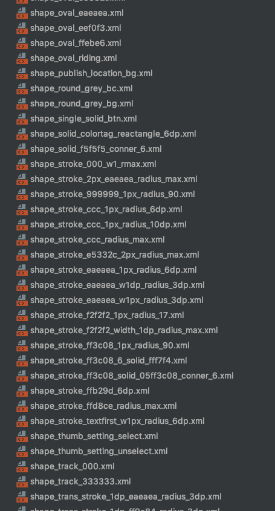
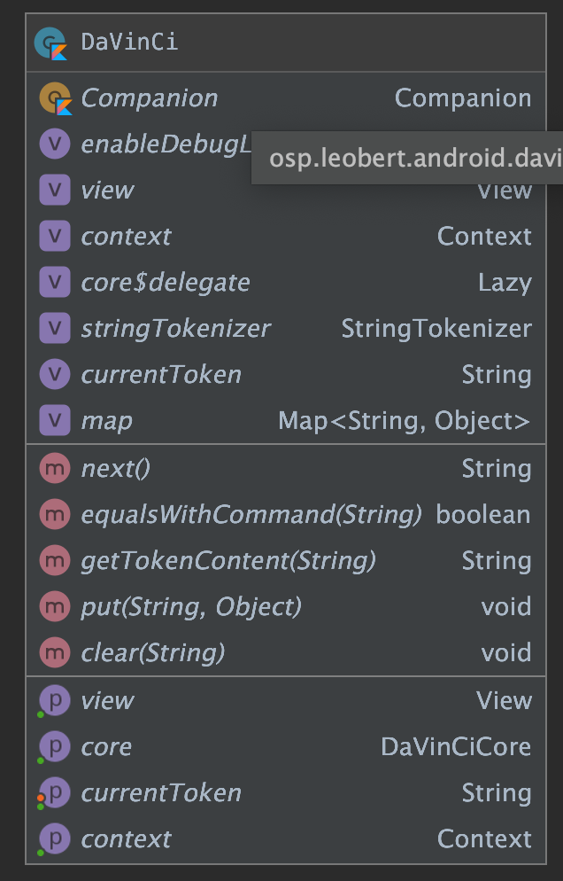
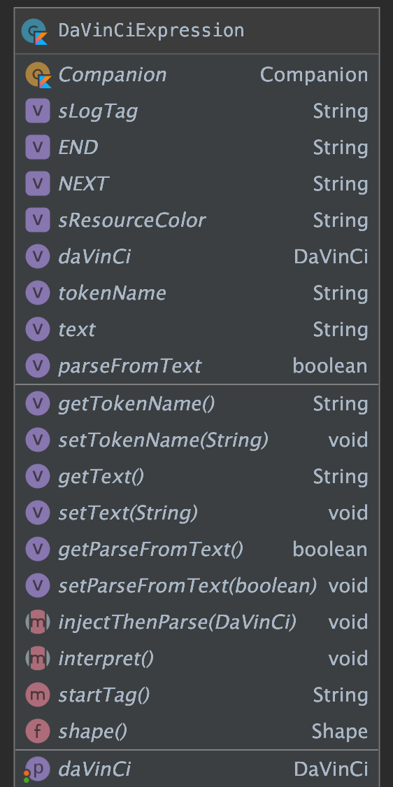
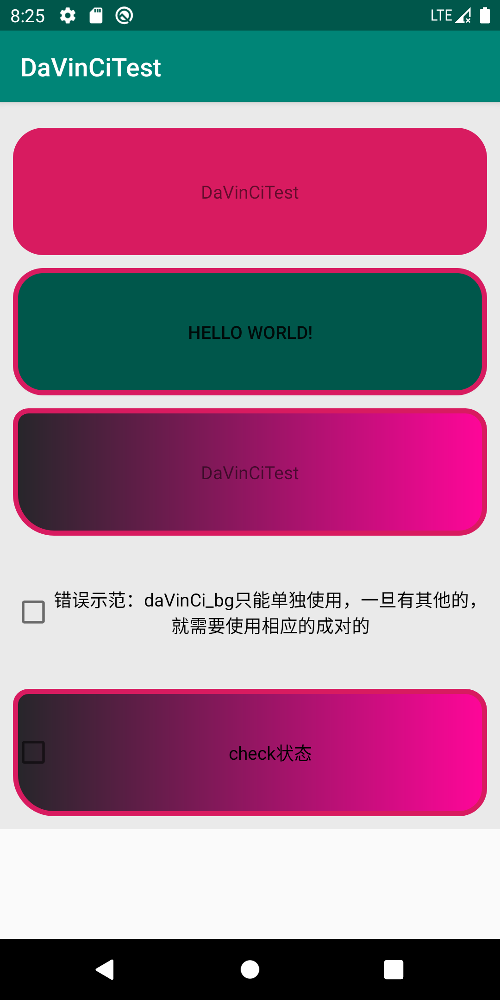
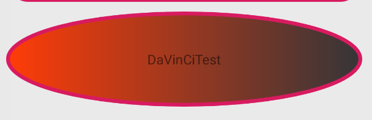

# 好玩系列：拥有它，XML文件少一半--更方便的处理View背景

## 前言

[关于好玩系列](https://github.com/leobert-lan/Blog/blob/main/info/%E5%85%B3%E4%BA%8E%E5%A5%BD%E7%8E%A9%E7%B3%BB%E5%88%97.md)

这是一项已经被我们项目`实验性投产`将近一年的方案，虽然还处于实验性阶段，但`稳定性`和`实用性`都不错。

[DaVinCi 仓库链接](https://github.com/leobert-lan/DaVinCi)
> 问题背景：Android 中普遍使用XML来定义资源，对于视图的背景样式而言，需要定义大量的
> `GradientDrawable`、`StateListDrawable` 资源等。当项目体量很大时。这些资源就会出现难管理的问题。

诚然，从`最佳实践`角度出发，**对项目中的资源进行合理地命名以满足查询索引规则，按照设计风格定义对应的Style，视图定义时利用Style约束其样式**。这才是
`优秀的做法`。但是，事与愿违，按照国内的从业者现状看，大多数处理大型项目的团队都`没有`做好这一点的`必要条件`。

在展开实践之前，我们不妨反思下为何会如此，不外乎：

* 缺乏或者频繁变动顶层`设计语言`，*这个词可能并不太准确*
* 以往的页面已经在线上运行了，设计新的页面簇改变了设计风格时，没有安排原有内容的统一修改并给到时间。
* 以上两条导致全栈Style混乱
* 当Style超过3种风格时，开发团队一般选择`毁灭吧，我累了`，谁动全栈风格跟谁急。

OK，既然都选择了毁灭吧,那为什么不选择一种更加舒适的方式来处理常见的背景问题。

## 挑选目标--最常用的Drawable资源

经过一番草率的筛选，我们很快锁定了目标：selector、shape

举个例子，窥一斑而见全豹：



这还只是一小部分，相信各位的项目中也会有这样的痛点吧。

且不谈 `命名规则` 是否合情合理，这是一种很反人类的设定，就像你忘记了密码，申请重置，按照一系列的密码规则， 终于设定了一个 `让你惴惴不安` 担心 `再次忘记` 的密码后，提交提示：不能和原密码一致。

对Drawable体系有一定了解的话，我们知道 selector、shape 分别对应：

* `StateListDrawable`
* `GradientDrawable`

*如果对Drawable体系还不太清楚的话，[可以简要阅读一下我之前的一篇博客：三思系列：重新认识Drawable](./三思系列：重新认识Drawable.md)*

## 换一种定义资源、解析资源的方式

布局文件中使用这些Drawable资源时，在View被创建后，会解析配置的属性，而Drawable相关的资源，会被DrawableInflater加载并运用。

这一点就不展开了。毫无疑问，如果要替换掉基于xml的资源定义方式，我们只能采用一个新的方式。但是，我们并`没有打算` 抛弃使用xml文件定义布局资源

且不卖关子，当时搜索枯肠，要满足：

* 丢弃单独文件定义
* 方便，不需要查手册

两个要素，只想到两个关键词： `DSL`，`OO`，没错，`领域特定语言` 和 `面向对象`。

严格来说，这两者基本是互斥的。

但是很抱歉，这里必须要先打住，要先讲点别的，然后再回到这个话题。

> 注，后面很大一段篇幅，会用于：
> * 解释抛弃自定义View和属性的方案
> * 使用Builder简化Drawable构造过程
> * DSL简介
> * 用DSL解决这个问题
> 
> 个人认为 `使用自定义文法` 和 `解释器`处理文法解析 是一件挺好玩的事情，值得玩一玩，
> 但限于我的水平，这段内容读起来可能很晦涩，如果不是非常感兴趣，可以直接跳过到：[到底是DSL还是OO](#anchor2)

### 抛弃了自定义View和属性的方式

在开始时，我考虑过这种方案。但是使用 `自定义的` `LayoutInflater` 或者 `hook` 系统LayoutInflater 都是可能影响到某些 `黑科技`的

就算不考虑干扰到其他黑科技，也需要严格的处理各种属性组合，并提供完善的查询手册，这很 `不人道主义`，

而基于十几个属性组合场景自定义lint规则，这 `很烦` ，一点都 `不好玩`

所以这个方案直接被否决

## 工欲善其事必先利其器，Drawable对象构建工具 -- Drawable Builder

因为 `StateListDrawable` 和 `GradientDrawable` 的内部细节都是比较多的，这句话等价于：构建这两者的实例对象比较复杂。

这很符合Builder模式的使用场景，我们先设计一个Builder来处理这两者的构建，并在构建过程中检验信息

> 这是一件比较枯燥的事情，代码略。详见DaVinCiCore.kt

在我们完善的考虑了 各种state下： 形状，渐变的角度、方式，填充，描边，尺寸，指定的drawable等之后，我们可以 "很方便" 的创建Drawable啦！

## 一套适应场景的DSL -- 定义规则

在内容展开之前，我们再回顾一下DSL的基础。

`DSL`即 `Domain Specified Language` 、`领域专用语言`。

Wikipedia中关于这个词条的描述：

> A specialized computer language designed for a specific task.

为了解决 `某类` `特定问题` 而设计的一种 `特殊` 的计算机语言

而马丁老爷子关于它的描述，看起来就很高深了，但我更喜欢这一个描述：

> A computer programming language of limited expressiveness focused on a particular domain.

一种 `抑制表达能力` 以 `专注于` `特定领域` 的计算机语言。

这种抑制，让它专注于特定的领域，而抛弃了其他的领域，以达到更加高效、准确的目的。

我们知道，xml协议的`扩展性非常强`，而这种扩展性，让它的`解析`变得非常的`繁琐`，继而带来了效率问题。Android中，为了 `兼顾` xml的 `扩展性` 和 使用的 `效率问题`， 定制了各类Inflater以处理特定的问题。

显然，我们这次不打算在巨人的肩膀上更进一步，而是要在特定问题上，剑走偏锋。

按照我们积累的知识，要构建一个 `GradientDrawable`，可能用到：

* 形状 shape
* 纯色填充色 solidColor
* 圆角相关：
    * cornersRadius
    * cornersBottomLeftRadius
    * cornersBottomRightRadius
    * cornersTopLeftRadius
    * cornersTopRightRadius
* 填充渐变：
    * 渐变方向角 gradientAngle
    * 渐变中点x gradientCenterX
    * 渐变中点y gradientCenterY
    * 渐变起始颜色 gradientStartColor
    * 渐变中点颜色 gradientCenterColor
    * 渐变终点颜色 gradientEndColor
* 渐变形式 gradient
* 形式为 RADIAL_GRADIENT时的 gradientRadius
* useLevel
* padding
* sizeWidth
* sizeHeight
* 描边宽度 strokeWidth
* 描边颜色 strokeColor
* 虚线段宽度 strokeDashWidth
* 虚线段间距 strokeDashGap

当然，我们还需要考虑到 `不同的状态`，和一些 `细节` ，这里先不展开

此时我们有两个选择方向，让我们的DSL类似于：

```
shape:[
    gradient:[type:linear;startColor:#ff3c08;endColor:#353538 ];
    st:[Oval];
    corners:[40 dp];
    stroke:[width:4 dp;color:rc / colorAccent ]
]
```

*ps，因为目标固定为设置background，所以语法式中忽略这种描述*

或者类似于sql的insert语句。

不过后者的 `字段` 太多，实在不适合阅读，而且SQL的 `表达能力` 相对于我们要处理的问题，还是过强了一点。

ok，我们再仔细设计一下规则。

终结符：

* `[` `]`,当前域的子句均置于其中，例：

```kotlin
域:[子域1:[值]]

shape:[st:[Oval]]
```

* `;`,当前域有多个子域时，子域之间用 `;` 分隔

非终结符：

* shape: 代表创建一个GradientDrawable
* st: 代表shape类型，枚举值为
    * Rectangle
    * Oval
    * Line
    * Ring
* corners: 圆角相关设置，值置于[]中，一个值代表4个角，4个值代表 左上、右上、右下、左下 四个值对应设置
* solid: 纯色填充，[]内为色值，色值表达见后
* gradient:渐变色，子命令置于 [] 中
    * type：渐变类型，枚举为：
        * linear
        * radial
        * sweep
    * startColor: 起始色
    * centerColor: 中间色
    * endColor: 结束色
    * centerX: 中点x
    * centerY: 中点y
    * angle: 渐变角度
* stroke: 描边，子命令置于 [] 中
    * width: 描边宽度
    * color: 描边颜色
    * dashWidth: 虚线宽
    * dashGap: 虚线间距
* size: 尺寸
    * width:
    * height:
* padding: 内边距
    * left
    * top
    * right
    * bottom

特殊规则：

* 尺寸描述：纯数字代表px，数值+dp 代表dp值，`w`代表 `wrap_content`，`m` 代表 `match_parent`
* 颜色表达："#ffffff"等色值字符串，代表ARGB值的 int 值，"rc/资源名" 表达资源引用， 以及用"@idName"来获取目标View的tag，tag值需为颜色字符串或者ARGB色

为了适当减少类的数量，我们约定：

* 不拥有子域的域弱化为属性，以`属性名:属性值`的方式表达，而不再需要 `[]` 符号
* 当某个域的属性只存在一个或者已经被约定时，可以忽略其属性名，直接使用属性值

> 注:重新整理时，我发现最开始编码的 `ShapeType` 和 `Corners` 没有重新按照上述约定修正，
> 这是一处遗忘修改的bug，准确的讲，是将子域弱化为属性时，期望略去终结符而带来的文法规则缺陷，读者**不要深究**。
>
> 出现这个bug的根本原因是：我当时想减少小类数量，并
> 一定程度上降低解析复杂度，将非终结符识别标记 和终结符 `[` 组合在了一起，替代原先的非终结符识别标记使用。


> 注2：主体是 GradientDrawable ，为什么用 Shape去对应？因为国内普遍存在的文章中，绝大多数都已经将
> Gradient 对应为"颜色的梯度渐变"，而将这一资源文件定义为 "形状"、带"填充"和"描边"的形状。而Android的资源定义语法中，
> 也是类似的。大家也都习惯了，索性尊重习惯。

## 解释器 -- 处理表达式解析

> 在GOF的设计模式中，`解释器模式` ( `Interpreter Pattern` ) 提供了 `评估` 语言的 `语法` 或 `表达式` 的方式，它属于 `行为型模式`。

需要注意，其实在这个问题的实际场景中，一条语句，子句出现的频率可能并不会太高，但解释器模式 `依旧是场景适用` 的。

我们再回顾一下解释器模式的 `优缺点`：

优点：

* 可扩展性比较好，灵活。
* 易于实现简单文法。

缺点：

* 对于复杂的文法比较难维护
* 可能引起类膨胀
* 采用递归调用方法，层级过深，可能出现效率问题

### 定义上下文



其中 `core:DaVinCiCore` 是上面提到的构建者，未遵循习惯命名法。
`view:View` 是要操作的View。

**源码枯燥，略**

### 抽象表达式



```kotlin
sealed class DaVinCiExpression(var daVinCi: DaVinCi? = null) {

    // 节点名称
    protected var tokenName: String? = null

    // 文本内容
    protected var text: String? = null

    //实际属性是否需要从text解析，手动创建并给了专有属性的，设为false，就不会被覆盖了
    protected var parseFromText = true

    abstract fun injectThenParse(daVinCi: DaVinCi?)

    /*
     * 执行方法
     */
    abstract fun interpret()

    open fun startTag(): String = ""

    companion object {
        @JvmStatic
        fun shape(): Shape = Shape(true)

        const val sLogTag = "DaVinCi"

        const val END = "]"

        const val NEXT = "];"

        const val sResourceColor = "rc/"
    }
}
```

### 终结符处理

只需要处理兄弟域的关系即可，例如，我们知道 solid 和 stroke 就是兄弟域，

```kotlin
 protected class ListExpression(daVinCi: DaVinCi? = null, private val manual: Boolean = false) :
    DaVinCiExpression(daVinCi) {
    private val list: ArrayList<DaVinCiExpression> = ArrayList()

    fun append(exp: DaVinCiExpression) {
        list.add(exp)
    }

    override fun injectThenParse(daVinCi: DaVinCi?) {
        this.daVinCi = daVinCi
        if (manual) {
            list.forEach { it.injectThenParse(daVinCi) }
            return
        }

        // 在ListExpression解析表达式中,循环解释语句中的每一个单词,直到终结符表达式或者异常情况退出
        daVinCi?.let {
            var i = 0
            while (i < 100) { // true,语法错误时有点可怕，先上限100
                if (it.currentToken == null) { // 获取当前节点如果为 null 则表示缺少]表达式
                    println("Error: The Expression Missing ']'! ")
                    break
                } else if (it.equalsWithCommand(END)) {
                    it.next()
                    // 解析正常结束
                    break
                } else if (it.equalsWithCommand(NEXT)) {
                    //进入同级别下一个解析
                    it.next()
                } else { // 建立Command 表达式
                    try {
                        val expressions: DaVinCiExpression = CommandExpression(it)
                        list.add(expressions)
                    } catch (e: Exception) {
                        if (DaVinCi.enableDebugLog) Log.e(sLogTag, "语法解析有误", e)
                        break
                    }
                }
                i++
            }
            if (i == 100) {
                if (DaVinCi.enableDebugLog) Log.e(sLogTag, "语法解析有误，进入死循环，强制跳出")
            }
        }
    }

    override fun interpret() { // 循环list列表中每一个表达式 解释执行
        list.forEach { it.interpret() }
    }

    override fun toString(): String {
        val b = StringBuilder()

        val iMax: Int = list.size - 1
        if (iMax == -1) return ""
        var i = 0
        while (true) {
            b.append(list[i].toString())
            if (i == iMax) return b.toString()
            b.append("; ")
            i++
        }
    }
}
```

### 非终结符的规则处理

```kotlin

open class CommandExpression(daVinCi: DaVinCi? = null, val manual: Boolean = false) :
    DaVinCiExpression(daVinCi) {
    private var expressions: DaVinCiExpression? = null

    init {
        //因为是嵌套层，且作为父类了，避免递归
        if (this::class == CommandExpression::class)
            onParse(daVinCi)
    }

    override fun injectThenParse(daVinCi: DaVinCi?) {
        onParse(daVinCi)
    }

    protected fun toPx(str: String, context: Context): Int? {
        //略
    }

    protected fun parseColor(text: String?): Int? {
        //略
    }

    protected fun parseInt(text: String?, default: Int?): Int? {
        //略
    }

    protected fun parseFloat(text: String?, default: Float?): Float? {
        //略
    }

    protected fun getTag(context: Context?, resName: String): String? {
        //略
    }

    protected fun getColor(context: Context?, resName: String?): Int? {
        //略
    }

    @Throws(Exception::class)
    private fun onParse(daVinCi: DaVinCi?) {
        this.daVinCi = daVinCi
        if (manual) return
        daVinCi?.let {
            expressions = when (it.currentToken) {
                Corners.tag -> Corners(it)
                Solid.tag -> Solid(it)
                ShapeType.tag -> ShapeType(it)
                Stroke.tag -> Stroke(it)
                Size.tag -> Size(it)
                Padding.tag -> Padding(it)
                Gradient.tag -> Gradient(it)
                else -> throw Exception("cannot parse ${it.currentToken}")
            }
        }
    }

    protected fun asPrimitiveParse(start: String, daVinCi: DaVinCi?) {
        this.daVinCi = daVinCi
        daVinCi?.let {
            tokenName = it.currentToken
            it.next()
            if (start == tokenName) {
                this.text = it.currentToken
                it.next()
            } else {
                it.next()
            }
        }
    }

    override fun interpret() {
        expressions?.interpret()
    }

    override fun toString(): String {
        return "$expressions"
    }
}
```

以solid为例：

```kotlin
class Solid(daVinCi: DaVinCi? = null, manual: Boolean = false) :
    CommandExpression(daVinCi, manual) {
    @ColorInt
    internal var colorInt: Int? = null //这是解析出来的，不要乱赋值

    companion object {
        const val tag = "solid:["
    }

    init {
        injectThenParse(daVinCi)
    }

    override fun injectThenParse(daVinCi: DaVinCi?) {
        this.daVinCi = daVinCi

        if (manual) {
            if (parseFromText)
                colorInt = parseColor(text)
            return
        }
        colorInt = null
        asPrimitiveParse(tag, daVinCi)
        colorInt = parseColor(text)

    }

    override fun interpret() {
        if (tag == tokenName || manual) {
            daVinCi?.let {
                colorInt?.let { color ->
                    it.core.setSolidColor(color)
                }
            }
        }
    }

    override fun toString(): String {
        return "$tag ${if (parseFromText) text else colorInt?.run { text }} $END"
    }
}
```

同理，我们处理完：

* Corners
* ShapeType
* Stroke
* Size
* Padding
* Gradient 

即可。

#### 最重要的Shape

至此，我们只需要再解析 `shape:[]` 即可完成工作。

很简单，只要我们识别出来，其子域的描述子句均可被提取出来，*利用 `;` 分割子句*，那么我们只需要用 `ListExpression` 即可储存子句。

代码略

> 注，至此，我们完成了文法的定义和解析处理，注意，目前所有的主体都是 GradientDrawable，他的文法已经足够复杂了，
> 
> StateListDrawable 所对应的各种状态
> 我们不在文法中进行扩展了，否则单条语句的长度会非常可怕。

## <a id="anchor2">到底是DSL还是OO</a>

> 前面我们谈到了这个问题，要满足
> * 丢弃单独文件定义
> * 方便，不需要查手册
> 
>两个要素，只想到两个关键词： `DSL`，`OO`，即 `领域特定语言` 和 `面向对象`。

当时我们切到了其他话题，并顺带着已经把 `DSL方案` 的核心实现了。

我们注意到，如果使用DSL，直接使用 `字符串形式` 的 `表达语句`，这 `很不人道主义`。

> 我们不太可能像web技术那样，再走一条 css 方式的道路

那么，我们目前做的都是鸡肋吗？

这个问题，笔者我目前也无法回答，因为我站得高度还不够高。

但是，这不影响我们继续探究：如何使用OO思想，让构建变得更加简单

### 在文法符号的相关类基础上，面向对象
在前面的工作中，我们定义了一堆 `终结符` 和 `非终结符` 对应的类，而其语法树结构，是通过直接反解
一段 `文法表达式字符串` 得到的。

反过来想，我们直接面向对象操作，也可以直接构建出期望的语法树。

只要有正确的语法树，执行后一样可以得到期望的结果。

**想通这一点，编码就很容易了，这里我们略去相关源码。**

> 注：至此，究竟是 `面向对象` 构建语法树处理问题，还是使用 `文法表达式字符串` 构建语法树，已经不再重要。
> 其本质都是构建语法树以描述Drawable的构建规则，只不过是在两个世界中的不同表达形式

### 最后一步，巧借东风，借助DataBinding，直接在xml中使用

我们知道，利用DataBinding，可以直接在xml中实现声明使用

再结合 `BindingAdapter` 机制，我们就可以实现 `声明背景` 的目标。

```kotlin

@BindingAdapter(
    "daVinCi_bg", "daVinCi_bg_pressed", "daVinCi_bg_unpressed",
    "daVinCi_bg_checkable", "daVinCi_bg_uncheckable", "daVinCi_bg_checked", "daVinCi_bg_unchecked",
    requireAll = false
)
fun View.daVinCi(
    normal: DaVinCiExpression? = null,
    pressed: DaVinCiExpression? = null, unpressed: DaVinCiExpression? = null,
    checkable: DaVinCiExpression? = null, uncheckable: DaVinCiExpression? = null,
    checked: DaVinCiExpression? = null, unchecked: DaVinCiExpression? = null
) {
    val daVinCi = DaVinCi(null, this)
    //用于多次构建
    val daVinCiLoop = DaVinCi(null, this)

    normal?.let {
        daVinCi.apply {
            currentToken = normal.startTag()
        }
        if (DaVinCi.enableDebugLog) Log.d(sLogTag, "${this.logTag()} daVinCi normal:$normal")

        normal.injectThenParse(daVinCi)
        normal.interpret()
    }

    pressed?.let {
        simplify(daVinCiLoop, it, "pressed", this)
        daVinCi.core.setPressedDrawable(daVinCiLoop.core.build())
        daVinCiLoop.core.clear()
    }

    unpressed?.let {
        simplify(daVinCiLoop, it, "unpressed", this)
        daVinCi.core.setUnPressedDrawable(daVinCiLoop.core.build())
        daVinCiLoop.core.clear()
    }

    checkable?.let {
        simplify(daVinCiLoop, it, "checkable", this)
        daVinCi.core.setCheckableDrawable(daVinCiLoop.core.build())
        daVinCiLoop.core.clear()
    }

    uncheckable?.let {
        simplify(daVinCiLoop, it, "uncheckable", this)
        daVinCi.core.setUnCheckableDrawable(daVinCiLoop.core.build())
        daVinCiLoop.core.clear()
    }

    checked?.let {
        simplify(daVinCiLoop, it, "checked", this)
        daVinCi.core.setCheckedDrawable(daVinCiLoop.core.build())
        daVinCiLoop.core.clear()
    }

    unchecked?.let {
        simplify(daVinCiLoop, it, "unchecked", this)
        daVinCi.core.setUnCheckedDrawable(daVinCiLoop.core.build())
        daVinCiLoop.core.clear()
    }


    //下面的略
    //    private var enabledDrawable: Drawable? = null
    //    private var unEnabledDrawable: Drawable? = null
    //    private var selectedDrawable: Drawable? = null
    //    private var focusedDrawable: Drawable? = null
    //    private var focusedHovered: Drawable? = null
    //    private var focusedActivated: Drawable? = null
    //    private var unSelectedDrawable: Drawable? = null
    //    private var unFocusedDrawable: Drawable? = null
    //    private var unFocusedHovered: Drawable? = null
    //    private var unFocusedActivated: Drawable? = null

    ViewCompat.setBackground(this, daVinCi.core.build())
}
```

示例：

```xml
<?xml version="1.0" encoding="utf-8"?>
<layout xmlns:android="http://schemas.android.com/apk/res/android"
    xmlns:tools="http://schemas.android.com/tools">

    <data>

        <variable
            name="a"
            type="String" />

        <import type="osp.leobert.android.davinci.DaVinCiExpression" />

    </data>

    <androidx.core.widget.NestedScrollView
        android:layout_width="match_parent"
        android:layout_height="match_parent"
        tools:context=".MainActivity">

        <LinearLayout
            daVinCi_bg="@{DaVinCiExpression.shape().solid(`#eaeaea`)}"
            android:layout_width="match_parent"
            android:layout_height="wrap_content"
            android:orientation="vertical"
            android:padding="10dp">

            <TextView
                android:id="@+id/test"
                daVinCi_bg="@{DaVinCiExpression.shape().corner(60).solid(`@i2`).stroke(`4dp`,`@i2`)}"
                android:layout_width="match_parent"
                android:layout_height="100dp"
                android:layout_marginTop="10dp"
                android:background="@drawable/test"
                android:gravity="center"
                android:text="@string/app_name">

                <tag
                    android:id="@id/i1"
                    android:value="@color/colorPrimaryDark" />

                <tag
                    android:id="@id/i2"
                    android:value="@color/colorAccent" />
            </TextView>

            <Button
                daVinCi_bg_pressed="@{DaVinCiExpression.shape().corner(`10dp,15dp,20dp,30dp`).stroke(`4dp`,`@i2`).gradient(`#26262a`,`#ff0699`,0)}"
                daVinCi_bg_unpressed="@{DaVinCiExpression.shape().corner(60).solid(`@i1`).stroke(`4dp`,`@i2`)}"
                android:layout_width="match_parent"
                android:layout_height="100dp"
                android:gravity="center"
                android:text="Hello World!">

                <tag
                    android:id="@id/i1"
                    android:value="@color/colorPrimaryDark" />

                <tag
                    android:id="@id/i2"
                    android:value="@color/colorAccent" />
            </Button>

            <TextView
                android:id="@+id/test2"
                daVinCi_bg="@{DaVinCiExpression.shape().corner(`10dp,15dp,20dp,30dp`).stroke(`4dp`,`@i2`).gradient(`#26262a`,`#ff0699`,0)}"
                android:layout_width="match_parent"
                android:layout_height="100dp"
                android:layout_marginTop="10dp"
                android:background="@drawable/test"
                android:gravity="center"
                android:text="@string/app_name">

                <tag
                    android:id="@id/i1"
                    android:value="@color/colorPrimaryDark" />

                <tag
                    android:id="@id/i2"
                    android:value="@color/colorAccent" />
            </TextView>

            <CheckBox
                daVinCi_bg="@{DaVinCiExpression.shape().corner(60).solid(`@i2`).stroke(`4dp`,`@i2`)}"
                daVinCi_bg_pressed="@{DaVinCiExpression.shape().corner(`10dp,15dp,20dp,30dp`).stroke(`4dp`,`@i2`).gradient(`#26262a`,`#ff0699`,0)}"
                android:layout_width="match_parent"
                android:layout_height="100dp"
                android:layout_marginTop="10dp"
                android:background="@drawable/test"
                android:gravity="center"
                android:text="错误示范：daVinCi_bg只能单独使用，一旦有其他的，就需要使用相应的成对的">

                <tag
                    android:id="@id/i1"
                    android:value="@color/colorPrimaryDark" />

                <tag
                    android:id="@id/i2"
                    android:value="@color/colorAccent" />
            </CheckBox>

            <CheckBox
                daVinCi_bg_checked="@{DaVinCiExpression.shape().corner(60).solid(`@i2`).stroke(`4dp`,`@i2`)}"
                daVinCi_bg_unchecked="@{DaVinCiExpression.shape().corner(`10dp,15dp,20dp,30dp`).stroke(`4dp`,`@i2`).gradient(`#26262a`,`#ff0699`,0)}"
                android:layout_width="match_parent"
                android:layout_height="100dp"
                android:layout_marginTop="10dp"
                android:background="@drawable/test"
                android:gravity="center"
                android:text="check状态">

                <tag
                    android:id="@id/log_tag"
                    android:value="测试log tag" />

                <tag
                    android:id="@id/i1"
                    android:value="@color/colorPrimaryDark" />

                <tag
                    android:id="@id/i2"
                    android:value="@color/colorAccent" />

                <tag
                    android:id="@id/i3"
                    android:value="@string/app_name" />
            </CheckBox>

        </LinearLayout>

    </androidx.core.widget.NestedScrollView>

</layout>
```
粗糙的Demo效果，见笑了： *感谢读者`鲁班贼六`同学提醒我补充效果图*



甚至可以玩杂耍，直接使用字符串形式的DSL内容：

```kotlin
binding.test2.setOnClickListener {
    it.daVinCi("shape:[ gradient:[ type:linear;startColor:#ff3c08;endColor:#353538 ];" +
            " st:[ Oval ]; corners:[ 40dp ]; stroke:[ width:4dp;color:rc/colorAccent ] ]")
}
```

注意，这个方式不推荐使用，很不利于维护，就是 `杂耍`，可以直接更新背景：



## 总结和展望

这一篇，我们从一个问题：

> xml定义的资源文件难以管理、维护

开始，尝试性的提出了一种 替代xml 定义背景资源文件的方式。并进行了知识展开和拓展。
最终实现了期望目标。

但是，使用 `xml文件` 或者其他形式的文件来定义资源，是有它的道理的，虽然，这种方式的弊端已经被长久诟病，
并且在新兴技术中，资源和代码的存在位置已经开始交融。

我们知道，Compose这一革命性技术，新事物想要完全替代旧事物，不是一朝一夕的事情，旧事物不会突然消失。

本文中的方案，我将其视为一次 `好玩` ，`跟时髦` 的尝试。并且我个人认为，这一方案还是有存在价值的。

而在此基础上，还可以继续开展 style定义和使用，`ColorStateList` 文法表达式。

今天是除夕，祝大家除夕快乐。


