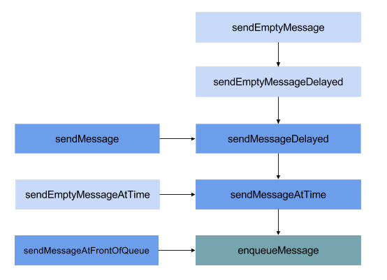

# 三思系列：Android的消息机制，一文吃透

> 三思系列是我最新的学习、总结形式，着重于:**问题分析**、**技术积累**、**视野拓展**，[关于三思系列](https://github.com/leobert-lan/Blog/blob/main/info/%E5%85%B3%E4%BA%8E%E4%B8%89%E6%80%9D%E7%B3%BB%E5%88%97.md)

## 前言

作为Android中 `至关重要` 的机制之一，十多年来，分析它的文章不断，大量的内容已经被挖掘过了。所以：

* 已经对这一机制比较 `熟稔` 的读者，在这篇文章中，看不到 `新东西` 了。
* 还不太熟悉消息机制的读者，可以在文章的基础上，继续挖一挖。

但是，经过简单的检索和分析，`大部分` 的文章是围绕：

* Handler，Looper，MQ的关系
* 上层的Handler，Looper、MQ 源码分析

展开的。单纯的从这些角度学习的话，并不能 `完全理解` 消息机制。

这篇文章本质还是 `一次脑暴` ，一来 `避免脑暴跑偏` ，二来帮助读者 `捋清内容脉络` 。先放出脑图：

```kotlin

//todo 脑图
```

## 脑暴：OS解决进程间通信问题有一种方式是使用消息队列

程序世界中，存在着大量的 `通信` 场景。搜索我们的知识，解决 `进程间通信` 问题有以下几种方式：

*这段内容可以选择性忽略，知道有就行，不影响往下阅读*

> * 管道
>     * 普通管道pipe：一种 `半双工` 的通信方式，数据只能 `单向流动` ，而且只能在具有 `亲缘关系` 的进程间使用。
>     * 命令流管道s_pipe: `全双工`，可以同时双向传输
>     * 命名管道FIFO：`半双工` 的通信方式，`允许` 在 `无亲缘关系` 的进程间通信。
>
>
> * 消息队列 MessageQueue：
>
> `消息的链表`，`存放在内核` 中 并由 `消息队列标识符` 标识。
> 消息队列克服了 `信号传递信息少`、`管道` 只能承载 `无格式字节流` 以及 `缓冲区大小受限` 等缺点。
>
> * 共享存储 SharedMemory：
>
> 映射一段 `能被其他进程所访问` 的内存，这段共享内存由 `一个进程创建`，但 `多个进程都可以访问`。
> 共享内存是 `最快的 IPC 方式`，它是针对 `其他` 进程间通信方式 `运行效率低` 而专门设计的。
> 往往与其他通信机制一同使用，如 `信号量` 配合使用，来实现进程间的同步和通信。
>
> * 信号量 Semaphore：
>
> 是一个 `计数器` ，可以用来控制多个进程对共享资源的访问。它常作为一种 `锁机制`，防止某进程正在访问共享资源时，
> 其他进程也访问该资源，实现 `资源的进程独占`。因此，主要作为 `进程间` 以及 `同一进程内线程间` 的同步手段。
>
> * 套接字Socket：
>
> 与其他通信机制不同的是，它可以 `通过网络` ，在 `不同机器之间` 进行进程通信。
>
> * 信号 signal：
>
> 用于通知接收进程 `某事件已发生`。机制比较复杂。

我们可以想象，Android之间也有大量的 `进程间通信场景`，OS必须采用 `至少一种` 机制，以实现进程间通信。

仔细研究下去，我们发现，Android OS用了不止一种方式。而且，Android 还基于 `OpenBinder` 开发了 `Binder` 用于 `用户空间` 内的进程间通信。

关于 **为什么不直接使用Linux中现有的进程间通信方式** ，可以看看[这篇知乎问答](https://www.zhihu.com/question/39440766/answer/89210950)

[这篇文章](https://www.jianshu.com/p/1b25bc6b861e) 也简单探讨了 "内核空间内的消息队列"

这里我们留一个问题以后探究：

> Android 有没有使用 Linux内核中的MessageQueue机制 干事情


基于消息队列的消息机制设计有很多优势，Android 在很多通信场景内，采用了这一设计思路。

## 消息机制的三要素

不管在哪，我们谈到消息机制，都会有这三个要素：

* `消息队列`
* `消息循环（分发）`
* `消息处理`

`消息队列` ，是 `消息对象` 的队列，基本规则是 `FIFO`。

`消息循环（分发）`， 基本是通用的机制，利用 `死循环` 不断的取出消息队列头部的消息，派发执行

`消息处理`，这里不得不提到 `消息` 有两种形式：

* Enrichment 自身信息完备
* Query-Back 自身信息不完备，需要回查

这两者的取舍，主要看系统中 `生成消息的开销` 和 `回查信息的开销` 两者的博弈。

在信息完备后，接收者即可处理消息。

## Android Framework中的消息队列

Android 的Framework中的消息队列有两个：

* Java层  `frameworks/base/core/java/android/os/MessageQueue.java`
* Native层 `frameworks/base/core/jni/android_os_MessageQueue.cpp`

Java层的MQ并不是 `List` 或者 `Queue` 之类的 Jdk内的数据结构实现。

Native层的源码我下载了一份 Android 10 的 [源码](code/android_os_MessageQueue.cpp) ，并不长，大家可以完整的读一读。

> 并不难理解：`用户空间` 会接收到来自 `内核空间` 的 `消息` ， 从 `下图` 我们可知，这部分消息先被 `Native层` 获知，所以：
> * 通过 `Native层` 建立消息队列，它拥有消息队列的各种基本能力
> * 利用`JNI` 打通 `Java层` 和 `Native层` 的 `Runtime屏障`，在Java层 `映射` 出消息队列
> * 应用建立在Java层之上，在Java层中实现消息的 `分发` 和 `处理`
> 
> PS：在Android 2.3那个时代，消息队列的实现是在Java层的，至于10年前为何改成了 native实现，
> 推测和CPU空转有关，笔者没有继续探究下去，如果有读者了解，希望可以留言帮我解惑。


*PS:还有一张经典的 `系统启动架构图` 没有找到，这张图更加直观*

### 代码解析

我们简单的 阅读、分析 下Native中的MQ源码

Native层消息队列的创建：

```cpp
static jlong android_os_MessageQueue_nativeInit(JNIEnv* env, jclass clazz) {
    NativeMessageQueue* nativeMessageQueue = new NativeMessageQueue();
    if (!nativeMessageQueue) {
        jniThrowRuntimeException(env, "Unable to allocate native queue");
        return 0;
    }

    nativeMessageQueue->incStrong(env);
    return reinterpret_cast<jlong>(nativeMessageQueue);
}
```

很简单，创建一个Native层的消息队列，如果创建失败，抛异常信息,返回0，否则将指针转换为Java的long型值返回。当然，会`被Java层的MQ所持有`。

`NativeMessageQueue` 类的构造函数

```cpp
NativeMessageQueue::NativeMessageQueue() :
        mPollEnv(NULL), mPollObj(NULL), mExceptionObj(NULL) {
    mLooper = Looper::getForThread();
    if (mLooper == NULL) {
        mLooper = new Looper(false);
        Looper::setForThread(mLooper);
    }
}
```
这里的Looper是native层Looper，通过静态方法 `Looper::getForThread()` 获取对象实例，如果未获取到，则创建实例，并通过静态方法设置。


看一下Java层MQ中会使用到的native方法

```java
class MessageQueue {
    private long mPtr; // used by native code

    private native static long nativeInit();

    private native static void nativeDestroy(long ptr);

    private native void nativePollOnce(long ptr, int timeoutMillis); /*non-static for callbacks*/

    private native static void nativeWake(long ptr);

    private native static boolean nativeIsPolling(long ptr);

    private native static void nativeSetFileDescriptorEvents(long ptr, int fd, int events);
}
```

对应签名：

```cpp
static const JNINativeMethod gMessageQueueMethods[] = {
    /* name, signature, funcPtr */
    { "nativeInit", "()J", (void*)android_os_MessageQueue_nativeInit },
    { "nativeDestroy", "(J)V", (void*)android_os_MessageQueue_nativeDestroy },
    { "nativePollOnce", "(JI)V", (void*)android_os_MessageQueue_nativePollOnce },
    { "nativeWake", "(J)V", (void*)android_os_MessageQueue_nativeWake },
    { "nativeIsPolling", "(J)Z", (void*)android_os_MessageQueue_nativeIsPolling },
    { "nativeSetFileDescriptorEvents", "(JII)V",
            (void*)android_os_MessageQueue_nativeSetFileDescriptorEvents },
};
```

`mPtr` 是Native层MQ的内存地址在Java层的映射。

#### Java层判断MQ是否还在工作：

```java
private boolean isPollingLocked() {
    // If the loop is quitting then it must not be idling.
    // We can assume mPtr != 0 when mQuitting is false.
    return !mQuitting && nativeIsPolling(mPtr);
}
```

```cpp
static jboolean android_os_MessageQueue_nativeIsPolling(JNIEnv* env, jclass clazz, jlong ptr) {
    NativeMessageQueue* nativeMessageQueue = reinterpret_cast<NativeMessageQueue*>(ptr);
    return nativeMessageQueue->getLooper()->isPolling();
}
```

```cpp
/**
 * Returns whether this looper's thread is currently polling for more work to do.
 * This is a good signal that the loop is still alive rather than being stuck
 * handling a callback.  Note that this method is intrinsically racy, since the
 * state of the loop can change before you get the result back.
 */
bool isPolling() const;
```

#### 唤醒 Native层MQ：

```cpp
static void android_os_MessageQueue_nativeWake(JNIEnv* env, jclass clazz, jlong ptr) {
    NativeMessageQueue* nativeMessageQueue = reinterpret_cast<NativeMessageQueue*>(ptr);
    nativeMessageQueue->wake();
}

void NativeMessageQueue::wake() {
    mLooper->wake();
}
```

#### 取消息：

```cpp
static void android_os_MessageQueue_nativePollOnce(JNIEnv* env, jobject obj,
        jlong ptr, jint timeoutMillis) {
    NativeMessageQueue* nativeMessageQueue = reinterpret_cast<NativeMessageQueue*>(ptr);
    nativeMessageQueue->pollOnce(env, obj, timeoutMillis);
}

void NativeMessageQueue::pollOnce(JNIEnv* env, jobject pollObj, int timeoutMillis) {
    mPollEnv = env;
    mPollObj = pollObj;
    mLooper->pollOnce(timeoutMillis);
    mPollObj = NULL;
    mPollEnv = NULL;

    if (mExceptionObj) {
        env->Throw(mExceptionObj);
        env->DeleteLocalRef(mExceptionObj);
        mExceptionObj = NULL;
    }
}
```

这里比较重要，我们先看看 Native层的Looper是 `如何取出消息` 的

```cpp
//Looper.h

int pollOnce(int timeoutMillis, int* outFd, int* outEvents, void** outData);
inline int pollOnce(int timeoutMillis) {
    return pollOnce(timeoutMillis, NULL, NULL, NULL);
}

//实现

int Looper::pollOnce(int timeoutMillis, int* outFd, int* outEvents, void** outData) {
    int result = 0;
    for (;;) {
        while (mResponseIndex < mResponses.size()) {
            const Response& response = mResponses.itemAt(mResponseIndex++);
            int ident = response.request.ident;
            if (ident >= 0) {
                int fd = response.request.fd;
                int events = response.events;
                void* data = response.request.data;
#if DEBUG_POLL_AND_WAKE
                ALOGD("%p ~ pollOnce - returning signalled identifier %d: "
                        "fd=%d, events=0x%x, data=%p",
                        this, ident, fd, events, data);
#endif
                if (outFd != NULL) *outFd = fd;
                if (outEvents != NULL) *outEvents = events;
                if (outData != NULL) *outData = data;
                return ident;
            }
        }

        if (result != 0) {
#if DEBUG_POLL_AND_WAKE
            ALOGD("%p ~ pollOnce - returning result %d", this, result);
#endif
            if (outFd != NULL) *outFd = 0;
            if (outEvents != NULL) *outEvents = 0;
            if (outData != NULL) *outData = NULL;
            return result;
        }

        result = pollInner(timeoutMillis);
    }
}

```
先处理Native层滞留的Response，然后调用pollInner。这里的细节比较复杂，稍后我们在 [Native Looper解析](#native_looper) 中进行脑暴。


> 先于此处细节分析，我们知道，调用一个方法，这是`阻塞的` ，用大白话描述即在方法返回前，调用者在 `等待`。

据此，我们可知，Java层调动 `native void nativePollOnce(long ptr, int timeoutMillis);` 过程中是阻塞的。

此时我们再阅读下Java层MQ的消息获取：代码比较长，直接在代码中进行要点注释。

在看之前，我们先单纯从 `TDD的角度` 思考下，有哪些 `主要场景` ：*当然，这些场景不一定都合乎Android现有的设计*

* 消息队列是否在工作中
    * 工作中，期望返回消息
    * 不工作，期望返回null
* 工作中的消息队列 `当前` 是否有消息
    * 不存在消息，阻塞 or 返回null？-- 如果返回null，则在外部需要需要 `保持空转` 或者 `唤醒机制`，以支持正常运作。从封装角度出发，应当 `保持空转`，自己解决问题
    * 存在消息
        * 特殊的 `内部功能性消息`，期望MQ内部自行处理
        * 已经到处理时间的消息， **返回消息**
        * 未到处理时间，*如果都是排过序的*，期望 `空转保持阻塞` or `返回静默并设置唤醒`？ 按照前面的讨论，是期望 `保持空转`
    


```java
class MessageQueue {
    Message next() {
        // Return here if the message loop has already quit and been disposed.
        // This can happen if the application tries to restart a looper after quit
        // which is not supported.
        // 1. 如果 native消息队列指针映射已经为0，即虚引用，说明消息队列已经退出，没有消息了。
        // 则返回 null
        final long ptr = mPtr;
        if (ptr == 0) {
            return null;
        }

        int pendingIdleHandlerCount = -1; // -1 only during first iteration
        int nextPollTimeoutMillis = 0;
        
        // 2. 死循环，当为获取到需要 `分发处理` 的消息时，保持空转
        for (;;) {
            if (nextPollTimeoutMillis != 0) {
                Binder.flushPendingCommands();
            }

            // 3. 调用native层方法，poll message，注意，消息还存在于native层
            nativePollOnce(ptr, nextPollTimeoutMillis);

            synchronized (this) {
                // Try to retrieve the next message.  Return if found.
                final long now = SystemClock.uptimeMillis();
                Message prevMsg = null;
                Message msg = mMessages;
                
                //4. 如果发现 barrier ，即同步屏障，则寻找队列中的下一个可能存在的异步消息
                if (msg != null && msg.target == null) {
                    // Stalled by a barrier.  Find the next asynchronous message in the queue.
                    do {
                        prevMsg = msg;
                        msg = msg.next;
                    } while (msg != null && !msg.isAsynchronous());
                }
                
                if (msg != null) {
                    // 5. 发现了消息，
                    // 如果是还没有到约定时间的消息，则设置一个 `下次唤醒` 的最大时间差
                    // 否则 `维护单链表信息` 并返回消息
                    
                    if (now < msg.when) {
                        // Next message is not ready.  Set a timeout to wake up when it is ready.
                        nextPollTimeoutMillis = (int) Math.min(msg.when - now, Integer.MAX_VALUE);
                    } else {
                        // 寻找到了 `到处理时间` 的消息。 `维护单链表信息` 并返回消息
                        // Got a message.
                        mBlocked = false;
                        if (prevMsg != null) {
                            prevMsg.next = msg.next;
                        } else {
                            mMessages = msg.next;
                        }
                        msg.next = null;
                        if (DEBUG) Log.v(TAG, "Returning message: " + msg);
                        msg.markInUse();
                        return msg;
                    }
                } else {
                    // No more messages.
                    nextPollTimeoutMillis = -1;
                }

                // 处理 是否需要 停止消息队列                
                // Process the quit message now that all pending messages have been handled.
                if (mQuitting) {
                    dispose();
                    return null;
                }

                // 维护 接下来需要处理的 IDLEHandler 信息，
                // 如果没有 IDLEHandler，则直接进入下一轮消息获取环节
                // 否则处理 IDLEHandler
                // If first time idle, then get the number of idlers to run.
                // Idle handles only run if the queue is empty or if the first message
                // in the queue (possibly a barrier) is due to be handled in the future.
                if (pendingIdleHandlerCount < 0
                        && (mMessages == null || now < mMessages.when)) {
                    pendingIdleHandlerCount = mIdleHandlers.size();
                }
                if (pendingIdleHandlerCount <= 0) {
                    // No idle handlers to run.  Loop and wait some more.
                    mBlocked = true;
                    continue;
                }

                if (mPendingIdleHandlers == null) {
                    mPendingIdleHandlers = new IdleHandler[Math.max(pendingIdleHandlerCount, 4)];
                }
                mPendingIdleHandlers = mIdleHandlers.toArray(mPendingIdleHandlers);
            }

            // 处理 IDLEHandler
            // Run the idle handlers.
            // We only ever reach this code block during the first iteration.
            for (int i = 0; i < pendingIdleHandlerCount; i++) {
                final IdleHandler idler = mPendingIdleHandlers[i];
                mPendingIdleHandlers[i] = null; // release the reference to the handler

                boolean keep = false;
                try {
                    keep = idler.queueIdle();
                } catch (Throwable t) {
                    Log.wtf(TAG, "IdleHandler threw exception", t);
                }

                if (!keep) {
                    synchronized (this) {
                        mIdleHandlers.remove(idler);
                    }
                }
            }

            // Reset the idle handler count to 0 so we do not run them again.
            pendingIdleHandlerCount = 0;

            // While calling an idle handler, a new message could have been delivered
            // so go back and look again for a pending message without waiting.
            nextPollTimeoutMillis = 0;
        }
    }
}
```

#### Java层压入消息

这就比较简单了，当消息本身合法，且消息队列还在工作中时。
依旧从 `TDD角度` 出发：

* 如果消息队列没有头，期望直接作为头
* 如果有头
    * `消息处理时间` 先于 `头消息` 或者是需要立即处理的消息，则作为新的头
    *  否则按照 `处理时间` 插入到合适位置

```java
 boolean enqueueMessage(Message msg, long when) {
        if (msg.target == null) {
            throw new IllegalArgumentException("Message must have a target.");
        }

        synchronized (this) {
            if (msg.isInUse()) {
                throw new IllegalStateException(msg + " This message is already in use.");
            }

            if (mQuitting) {
                IllegalStateException e = new IllegalStateException(
                        msg.target + " sending message to a Handler on a dead thread");
                Log.w(TAG, e.getMessage(), e);
                msg.recycle();
                return false;
            }

            msg.markInUse();
            msg.when = when;
            Message p = mMessages;
            boolean needWake;
            if (p == null || when == 0 || when < p.when) {
                // New head, wake up the event queue if blocked.
                msg.next = p;
                mMessages = msg;
                needWake = mBlocked;
            } else {
                // Inserted within the middle of the queue.  Usually we don't have to wake
                // up the event queue unless there is a barrier at the head of the queue
                // and the message is the earliest asynchronous message in the queue.
                needWake = mBlocked && p.target == null && msg.isAsynchronous();
                Message prev;
                for (;;) {
                    prev = p;
                    p = p.next;
                    if (p == null || when < p.when) {
                        break;
                    }
                    if (needWake && p.isAsynchronous()) {
                        needWake = false;
                    }
                }
                msg.next = p; // invariant: p == prev.next
                prev.next = msg;
            }

            // We can assume mPtr != 0 because mQuitting is false.
            if (needWake) {
                nativeWake(mPtr);
            }
        }
        return true;
    }
```

`同步屏障 barrier`后面单独脑暴， 其他部分就先不看了

## Java层消息分发

这一节开始，我们脑暴消息分发，前面我们已经看过了 `MessageQueue` ，消息分发就是 `不停地` 从 `MessageQueue` 中取出消息，并指派给处理者。
完成这一工作的，是Looper。

在前面，我们已经知道了，Native层也有Looper，但是`不难理解`：
* 消息队列需要 `桥梁` 连通 Java层和Native层
* Looper只需要 `在自己这一端`，处理自己的消息队列分发即可

所以，我们看Java层的消息分发时，看Java层的Looper即可。

关注三个主要方法：
* 出门上班
* 工作
* 下班回家

### 出门上班 prepare

```java
class Looper {

    public static void prepare() {
        prepare(true);
    }

    private static void prepare(boolean quitAllowed) {
        if (sThreadLocal.get() != null) {
            throw new RuntimeException("Only one Looper may be created per thread");
        }
        sThreadLocal.set(new Looper(quitAllowed));
    }
}
```

这里有两个注意点：

* 已经出了门，除非再进门，否则没法再出门了。同样，一个线程有一个Looper就够了，只要它还活着，就没必要再建一个。
* 责任到人，一个Looper服务于一个Thread，这需要 `注册` ，代表着 `某个Thread` 已经由自己服务了。利用了ThreadLocal，因为多线程访问集合，`总需要考虑
竞争`，这很不人道主义，干脆分家，每个Thread操作自己的内容互不干扰，也就没有了竞争，于是封装了 `ThreadLocal`


### 上班 loop

注意工作性质是 `分发`，并不需要自己处理

* 没有 `注册` 自然就找不到负责这份工作的人。
* 已经在工作了就不要催，催了会导致工作出错，顺序出现问题。
* 工作就是不断的取出 `老板`-- `MQ` 的 `指令` -- `Message`，并交给 `相关负责人` -- `Handler` 去处理，并记录信息
* `007`，不眠不休，`当MQ再也不发出消息了`，没活干了，大家都散了吧，下班回家

```java
class Looper {
    public static void loop() {
        final Looper me = myLooper();
        if (me == null) {
            throw new RuntimeException("No Looper; Looper.prepare() wasn't called on this thread.");
        }
        if (me.mInLoop) {
            Slog.w(TAG, "Loop again would have the queued messages be executed"
                    + " before this one completed.");
        }

        me.mInLoop = true;
        final MessageQueue queue = me.mQueue;

        // Make sure the identity of this thread is that of the local process,
        // and keep track of what that identity token actually is.
        Binder.clearCallingIdentity();
        final long ident = Binder.clearCallingIdentity();

        // Allow overriding a threshold with a system prop. e.g.
        // adb shell 'setprop log.looper.1000.main.slow 1 && stop && start'
        final int thresholdOverride =
                SystemProperties.getInt("log.looper."
                        + Process.myUid() + "."
                        + Thread.currentThread().getName()
                        + ".slow", 0);

        boolean slowDeliveryDetected = false;

        for (;;) {
            Message msg = queue.next(); // might block
            if (msg == null) {
                // No message indicates that the message queue is quitting.
                return;
            }

            // This must be in a local variable, in case a UI event sets the logger
            final Printer logging = me.mLogging;
            if (logging != null) {
                logging.println(">>>>> Dispatching to " + msg.target + " " +
                        msg.callback + ": " + msg.what);
            }
            // Make sure the observer won't change while processing a transaction.
            final Observer observer = sObserver;

            final long traceTag = me.mTraceTag;
            long slowDispatchThresholdMs = me.mSlowDispatchThresholdMs;
            long slowDeliveryThresholdMs = me.mSlowDeliveryThresholdMs;
            if (thresholdOverride > 0) {
                slowDispatchThresholdMs = thresholdOverride;
                slowDeliveryThresholdMs = thresholdOverride;
            }
            final boolean logSlowDelivery = (slowDeliveryThresholdMs > 0) && (msg.when > 0);
            final boolean logSlowDispatch = (slowDispatchThresholdMs > 0);

            final boolean needStartTime = logSlowDelivery || logSlowDispatch;
            final boolean needEndTime = logSlowDispatch;

            if (traceTag != 0 && Trace.isTagEnabled(traceTag)) {
                Trace.traceBegin(traceTag, msg.target.getTraceName(msg));
            }

            final long dispatchStart = needStartTime ? SystemClock.uptimeMillis() : 0;
            final long dispatchEnd;
            Object token = null;
            if (observer != null) {
                token = observer.messageDispatchStarting();
            }
            long origWorkSource = ThreadLocalWorkSource.setUid(msg.workSourceUid);
            try {
                //注意这里
                msg.target.dispatchMessage(msg);
                if (observer != null) {
                    observer.messageDispatched(token, msg);
                }
                dispatchEnd = needEndTime ? SystemClock.uptimeMillis() : 0;
            } catch (Exception exception) {
                if (observer != null) {
                    observer.dispatchingThrewException(token, msg, exception);
                }
                throw exception;
            } finally {
                ThreadLocalWorkSource.restore(origWorkSource);
                if (traceTag != 0) {
                    Trace.traceEnd(traceTag);
                }
            }
            if (logSlowDelivery) {
                if (slowDeliveryDetected) {
                    if ((dispatchStart - msg.when) <= 10) {
                        Slog.w(TAG, "Drained");
                        slowDeliveryDetected = false;
                    }
                } else {
                    if (showSlowLog(slowDeliveryThresholdMs, msg.when, dispatchStart, "delivery",
                            msg)) {
                        // Once we write a slow delivery log, suppress until the queue drains.
                        slowDeliveryDetected = true;
                    }
                }
            }
            if (logSlowDispatch) {
                showSlowLog(slowDispatchThresholdMs, dispatchStart, dispatchEnd, "dispatch", msg);
            }

            if (logging != null) {
                logging.println("<<<<< Finished to " + msg.target + " " + msg.callback);
            }

            // Make sure that during the course of dispatching the
            // identity of the thread wasn't corrupted.
            final long newIdent = Binder.clearCallingIdentity();
            if (ident != newIdent) {
                Log.wtf(TAG, "Thread identity changed from 0x"
                        + Long.toHexString(ident) + " to 0x"
                        + Long.toHexString(newIdent) + " while dispatching to "
                        + msg.target.getClass().getName() + " "
                        + msg.callback + " what=" + msg.what);
            }

            msg.recycleUnchecked();
        }
    }
}

```
### 下班 quit/quitSafely

这是比较粗暴的行为，MQ离开了Looper就没法正常工作了，即下班即意味着辞职

```java
class Looper {
    public void quit() {
        mQueue.quit(false);
    }
    
    public void quitSafely() {
        mQueue.quit(true);
    }
}
```

## 消息处理 Handler

这里就比较清晰了。API基本分为以下几类：

面向使用者：

* 创建Message，通过Message的 `享元模式`
* 发送消息，注意postRunnable也是一个消息
* 移除消息，
* 退出等

面向消息处理：

```java
class Handler {
    /**
     * Subclasses must implement this to receive messages.
     */
    public void handleMessage(@NonNull Message msg) {
    }

    /**
     * Handle system messages here.
     * Looper分发时调用的API
     */
    public void dispatchMessage(@NonNull Message msg) {
        if (msg.callback != null) {
            handleCallback(msg);
        } else {
            if (mCallback != null) {
                if (mCallback.handleMessage(msg)) {
                    return;
                }
            }
            handleMessage(msg);
        }
    }
}
```

如果有 `Handler callback`，则交给callback处理，否则自己处理，如果没覆写 `handleMessage` ，消息相当于被 drop 了。

消息发送部分可以结合下图梳理：



---
> 阶段性小结,至此，我们已经对 `Framework层的消息机制` 有一个完整的了解了。
> 前面我们梳理了：
> * Native层 和 Java层均有消息队列，并且通过JNI和指针映射，存在对应关系
> * Native层 和 Java层MQ `消息获取时的大致过程`
> * Java层 Looper 如何工作
> * Java层 Handler 大致概览
>
> 根据前面梳理的内容，可以总结：从 `Java Runtime` 看：
> * 消息队列机制服务于 `线程级别`，即一个线程有一个工作中的消息队列即可，当然，也可以没有。
> 即，一个Thread `至多有` 一个工作中的Looper。
> * Looper 和 Java层MQ `一一对应`
> * Handler 是MQ的入口，也是 `消息` 的处理者
> * 消息-- `Message` 应用了 `享元模式`，自身信息足够，满足 `自洽`，创建消息的开销性对较大，所以利用享元模式对消息对象进行复用。

下面我们再继续探究细节，解决前面语焉不详处留下的疑惑：

* 消息的类型和本质
* Native层Looper 的pollInner

---

## 消息的类型和本质

message中的几个重要成员变量：

```java
class Message {
   
    public int what;
    
    public int arg1;
    
    public int arg2;
    
    public Object obj;

    public Messenger replyTo;

    /*package*/ int flags;
    
    public long when;

    /*package*/ Bundle data;

    /*package*/ Handler target;

    /*package*/ Runnable callback;

}
```

其中 target是 `目标`，如果没有目标，那就是一个特殊的消息： `同步屏障` 即 `barrier`；

what 是消息标识
arg1 和 arg2 是开销较小的 `数据`，如果 `不足以表达信息`  则可以放入 `Bundle data` 中。

replyTo 和 obj 是跨进程传递消息时使用的，暂且不看。

flags 是 message 的状态标识，例如 `是否在使用中`，`是否是同步消息`

> 上面提到的同步屏障，即 barrier，其作用是拦截后面的 `同步消息` 不被获取，在前面阅读Java层MQ的next方法时读到过。
> 
> 我们还记得，next方法中，使用死循环，尝试读出一个满足处理条件的消息，如果取不到，因为死循环的存在，调用者（Looper）会被一直阻塞。

此时可以印证一个结论，消息按照 `功能分类` 可以分为 `三种`：

* 普通消息
* 同步屏障消息
* 异步消息

其中同步消息是一种内部机制。设置屏障之后需要在合适时间取消屏障，否则会导致 `普通消息永远无法被处理`，而取消时，需要用到设置屏障时返回的token。

## <a id="native_looper">Native层Looper</a>

相信大家都对 `Native层` 的Looper产生兴趣了，想看看它在Native层都干些什么。

对完整源码感兴趣的可以看这里，下面我们节选部分进行阅读。

前面提到了Looper的pollOnce，处理完搁置的Response之后，会调用pollInner获取消息

```cpp
int Looper::pollInner(int timeoutMillis) {
#if DEBUG_POLL_AND_WAKE
    ALOGD("%p ~ pollOnce - waiting: timeoutMillis=%d", this, timeoutMillis);
#endif

    // Adjust the timeout based on when the next message is due.
    if (timeoutMillis != 0 && mNextMessageUptime != LLONG_MAX) {
        nsecs_t now = systemTime(SYSTEM_TIME_MONOTONIC);
        int messageTimeoutMillis = toMillisecondTimeoutDelay(now, mNextMessageUptime);
        if (messageTimeoutMillis >= 0
                && (timeoutMillis < 0 || messageTimeoutMillis < timeoutMillis)) {
            timeoutMillis = messageTimeoutMillis;
        }
#if DEBUG_POLL_AND_WAKE
        ALOGD("%p ~ pollOnce - next message in %lldns, adjusted timeout: timeoutMillis=%d",
                this, mNextMessageUptime - now, timeoutMillis);
#endif
    }

    // Poll.
    int result = ALOOPER_POLL_WAKE;
    mResponses.clear();
    mResponseIndex = 0;

    struct epoll_event eventItems[EPOLL_MAX_EVENTS];
    
    //注意 1
    int eventCount = epoll_wait(mEpollFd, eventItems, EPOLL_MAX_EVENTS, timeoutMillis);

    // Acquire lock.
    mLock.lock();

// 注意 2
    // Check for poll error.
    if (eventCount < 0) {
        if (errno == EINTR) {
            goto Done;
        }
        ALOGW("Poll failed with an unexpected error, errno=%d", errno);
        result = ALOOPER_POLL_ERROR;
        goto Done;
    }

// 注意 3
    // Check for poll timeout.
    if (eventCount == 0) {
#if DEBUG_POLL_AND_WAKE
        ALOGD("%p ~ pollOnce - timeout", this);
#endif
        result = ALOOPER_POLL_TIMEOUT;
        goto Done;
    }

//注意 4
    // Handle all events.
#if DEBUG_POLL_AND_WAKE
    ALOGD("%p ~ pollOnce - handling events from %d fds", this, eventCount);
#endif

    for (int i = 0; i < eventCount; i++) {
        int fd = eventItems[i].data.fd;
        uint32_t epollEvents = eventItems[i].events;
        if (fd == mWakeReadPipeFd) {
            if (epollEvents & EPOLLIN) {
                awoken();
            } else {
                ALOGW("Ignoring unexpected epoll events 0x%x on wake read pipe.", epollEvents);
            }
        } else {
            ssize_t requestIndex = mRequests.indexOfKey(fd);
            if (requestIndex >= 0) {
                int events = 0;
                if (epollEvents & EPOLLIN) events |= ALOOPER_EVENT_INPUT;
                if (epollEvents & EPOLLOUT) events |= ALOOPER_EVENT_OUTPUT;
                if (epollEvents & EPOLLERR) events |= ALOOPER_EVENT_ERROR;
                if (epollEvents & EPOLLHUP) events |= ALOOPER_EVENT_HANGUP;
                pushResponse(events, mRequests.valueAt(requestIndex));
            } else {
                ALOGW("Ignoring unexpected epoll events 0x%x on fd %d that is "
                        "no longer registered.", epollEvents, fd);
            }
        }
    }
Done: ;

// 注意 5
    // Invoke pending message callbacks.
    mNextMessageUptime = LLONG_MAX;
    while (mMessageEnvelopes.size() != 0) {
        nsecs_t now = systemTime(SYSTEM_TIME_MONOTONIC);
        const MessageEnvelope& messageEnvelope = mMessageEnvelopes.itemAt(0);
        if (messageEnvelope.uptime <= now) {
            // Remove the envelope from the list.
            // We keep a strong reference to the handler until the call to handleMessage
            // finishes.  Then we drop it so that the handler can be deleted *before*
            // we reacquire our lock.
            { // obtain handler
                sp<MessageHandler> handler = messageEnvelope.handler;
                Message message = messageEnvelope.message;
                mMessageEnvelopes.removeAt(0);
                mSendingMessage = true;
                mLock.unlock();

#if DEBUG_POLL_AND_WAKE || DEBUG_CALLBACKS
                ALOGD("%p ~ pollOnce - sending message: handler=%p, what=%d",
                        this, handler.get(), message.what);
#endif
                handler->handleMessage(message);
            } // release handler

            mLock.lock();
            mSendingMessage = false;
            result = ALOOPER_POLL_CALLBACK;
        } else {
            // The last message left at the head of the queue determines the next wakeup time.
            mNextMessageUptime = messageEnvelope.uptime;
            break;
        }
    }

    // Release lock.
    mLock.unlock();

//注意 6
    // Invoke all response callbacks.
    for (size_t i = 0; i < mResponses.size(); i++) {
        Response& response = mResponses.editItemAt(i);
        if (response.request.ident == ALOOPER_POLL_CALLBACK) {
            int fd = response.request.fd;
            int events = response.events;
            void* data = response.request.data;
#if DEBUG_POLL_AND_WAKE || DEBUG_CALLBACKS
            ALOGD("%p ~ pollOnce - invoking fd event callback %p: fd=%d, events=0x%x, data=%p",
                    this, response.request.callback.get(), fd, events, data);
#endif
            int callbackResult = response.request.callback->handleEvent(fd, events, data);
            if (callbackResult == 0) {
                removeFd(fd);
            }
            // Clear the callback reference in the response structure promptly because we
            // will not clear the response vector itself until the next poll.
            response.request.callback.clear();
            result = ALOOPER_POLL_CALLBACK;
        }
    }
    return result;
}
```
上面标记了注意点

* 1 epoll机制，等待 `mEpollFd` 产生事件, 这个等待具有超时时间。
* 2，3，4 是等待的三种结果，`goto` 语句可以直接跳转到 `标记` 处
* 2 检测poll `是否出错`，如果有，跳转到 Done
* 3 检测pool `是否超时`，如果有，跳转到 Done
* 4 处理epoll后所有的事件
* 5 处理 pending 消息的回调
* 6 处理 所有 Response的回调

并且我们可以发现返回的结果有以下几种：
* ALOOPER_POLL_WAKE
* ALOOPER_POLL_ERROR


当上层发消息时且判断需要唤醒,则会往管道的读端写入数据用于唤醒(详见6.2.3);
检测poll是否出错;
检测poll是否超时;

如果是因为往管道读端写入数据被唤醒,则都去并清空管道中的数据;


repo init -u git://mirrors.ustc.edu.cn/aosp/platform/manifest -b android-9.0.0_r8