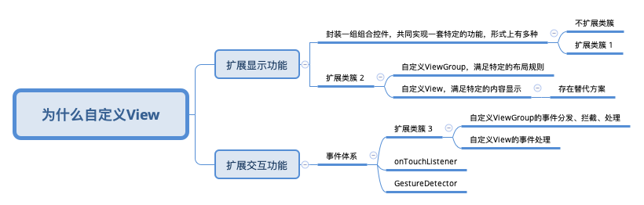

# 三思系列：为什么要自定义View

## 前言

> 或许你掌握了 `measure的细节` ，`layout机制` ，`事件传递机制` ，`canvas各种API` ，但是，你们想过这个问题吗？
> 
> 这一篇，不仅仅是对一个面试必会题的解析，更是透过这个问题的思考，寻找 `最佳实践` ，`拓展思维角度` ， `少走弯路`

[关于三思系列](https://github.com/leobert-lan/Blog/blob/main/info/%E5%85%B3%E4%BA%8E%E4%B8%89%E6%80%9D%E7%B3%BB%E5%88%97.md)

[关于View系列](https://github.com/leobert-lan/Blog/blob/main/info/%E5%85%B3%E4%BA%8EView%E7%B3%BB%E5%88%97.md)
View系列旨在通过 `对现实问题` 的思考，建立完善的 `View体系认知`，极力建议读者了解一下 `我为什么撰写、分享这个系列`

先给出思考这个问题的 `脑图` ，文章内容会按照思考过程展开

思考这类问题，`为什么要这样干` 是最基本，作为三思系列的成员，本篇还将对以下内容点进行展开论述：

* 怎么干 -- `How to do`
* 是否一定要这样干 -- `适用场景`
* 如果不这样干，还可以怎么干 -- `Best Practice`
* 各种干法的 `注意事项`

## 从View体系出现的目的说起

作为 `GUI` *Graphical User Interface，图形用户接口* 类型的程序 `framework`，`View体系`是其 `必不可少` 的一部分。参与了两件重要的事情：

* `描述`、`呈现` 界面
* 参与 `人机交互`

> 笼统的讲，当 `现有` 的 `View体系`内的 `控件簇` 无法满足合理需求时，可以在遵从 framework `内在` 的 `规则` 、`机制` ，进行扩展，以满足需求。

从这个角度看，扩展可以有两个方面：

* 扩展 `显示` 功能
* 扩展 `交互` 功能

## 扩展显示功能

我们知道，这又分为3种：

* 通过一组控件，共同完成特定的功能，
* 扩展布局规则
* 扩展内容显示

### 最简单的，一组控件完成特定功能

> 举个例子： `输入框` 右侧加一个 模态的`图片`，输入框有内容时显示，无内容时隐藏。图片显示一个❌，点击时清除输入框的内容

经过简单的封装，我们可以很快的完成这样的功能。

Android的UI描述并不那么方便，为了方便，往往会定义一个ViewGroup的子类，来描述这个 `控件组`。
但是 `组合优于继承`，这样的做法让人有点 `膈应`，不能算作是最佳实践。-- 这一点对应了脑图中的 `扩展类簇1`

相比于这样干，我更建议使用 `Facade模式` 进行逻辑封装，采用`xml方式` 声明这个控件组，或者封装 `命令式构建函数`构建这个控件组。

### 继承ViewGroup，扩展布局规则

Android中ViewGroup来封装布局规则，并提供了一套Layout。

当这些布局规则 `无法满足` 我们的需求时，我们可以通过 `自定义ViewGroup` 的方式来实现 `自定义布局规则`。

当然，Android发展到如今，已经 `很难` 找到一个`相对抽象`的布局规则，却没有被官方支持。

若确有必要，扩展布局规则时需要处理：

* 封装规则描述，并实现 `契约式编程设计`
    * 定义LayoutParams，封装规则的细节点描述
    * 覆写 checkLayoutParams 以实现规则校验，`契约式编程设计`
    * 覆写 generateLayoutParams(AttributeSet attrs) 以实现 `从xml属性生成LayoutParams`
    * 覆写 generateLayoutParams(ViewGroup.LayoutParams p) 以实现 `当规则不满足契约`时，生成一个满足契约的LayoutParams，注意：可以从原LayoutParams中
    采纳一些内容。
    * 覆写 generateDefaultLayoutParams 以实现生成符合契约的 `默认布局规则`，如果返回null，在`addView(View)` 时，会引起运行时异常
* 在 `onMeasure` 方法中处理测量的逻辑，以实现 `确定自身大小` 和 `触发子View测量`
    * 接受 `Parent` 给到自身的 `尺寸测量信息`，如果测量模式是 `EXACTLY`，即可直接确定自身对应维度的尺寸；如果是 `AT_MOST` 或者 `UNSPECIFIED`，
      则需要先测量子View，再确定自身。
    * 按照布局特性，自身的 `尺寸测量信息`，和子View的布局规则属性值，确定 `子View` 的 `尺寸测量信息`，调用 `子View` 的 `measure` 方法触发测量
* 在 `onLayout` 方法中，处理布局，使用子View的 `尺寸测量值` 和 `LayoutParams规则值`，计算子View 的布局位置，并调用 `子View` 的 `layout`
方法触发子View布局
* 如果有特定需求，可以在 `onDraw` 中进行绘制，例如绘制分隔线

### 继承View，扩展内容显示能力

