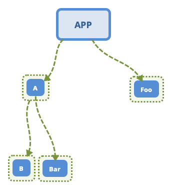

# 三思系列：组件化场景下module依赖优雅实践方案

## 前言

[关于三思系列](https://github.com/leobert-lan/Blog/blob/main/info/%E5%85%B3%E4%BA%8E%E4%B8%89%E6%80%9D%E7%B3%BB%E5%88%97.md)

> 背景：
> 如果没有记错，15年那会Android项目逐步转向使用Gradle构建，时至今日，组件化已经不再是一个新颖的话题。
> 
> 虽然我将这篇文章放在了`Gradle分类`中，但是我们知道，使用gradle构建的后端项目，
> 热点聚焦在：实现`微服务化`，项目是拆开的，决定了依赖库已经是静态jar包，和我们
> 要讨论的场景是不一致的。所以我们还是在`Android`领域中讨论这个问题.
> 
> 在各种方案的组件化实施中，一定会将`部分功能模块拆分`，进行`library下沉`。
> 于是，就有了`处理依赖`的场景。
> 
> 相信大家思考过这样一个问题：如果下沉的`library`也提前编译好`静态aar包`，我们的项目编译时间会缩短。 
> 毋庸置疑，这样做会直接从`源头解决` `编译时间长的问题`，就是`减少编译内容`。
> 
> `但是`，项目合并在一起，难免就想在开发下层library时，直接用上层业务集成进行冒烟。 *ps:这个做法并不好，应当为library配置好冒烟测试环境，虽然会耗费掉一定的时间*
> 
> 理想归理想，最终还是会败给现实，这个问题就变成了`鱼和熊掌想要兼得`的问题

为了让阅读的目标更加明确，我们先思考一个问题：



这样一个项目依赖关系，如果做到`改动B` 的内容，却不需要重新编译A，运行APP，验证B的修改


我们下面会进行一定地展开，来体悟这个问题。


## 为什么使用远程仓库中的依赖包比使用本地静态aar要方便

我们知道，对于一个module，我们对其进行编译生成静态aar包，只会处理它自身的内容。那么他的依赖是如何传递的？

`通过pom文件`

举个例子：

我们新建一个module，看一下依赖：

```groovy
dependencies {

    implementation "org.jetbrains.kotlin:kotlin-stdlib:$kotlin_version"
    implementation 'androidx.core:core-ktx:1.3.2'
    implementation 'androidx.appcompat:appcompat:1.2.0'
    implementation 'com.google.android.material:material:1.2.1'
    testImplementation 'junit:junit:4.+'
    androidTestImplementation 'androidx.test.ext:junit:1.1.2'
    androidTestImplementation 'androidx.test.espresso:espresso-core:3.3.0'
}
```

利用maven plugin 进行发布，会有任务生成pom文件，如下：

```xml
<?xml version="1.0" encoding="UTF-8"?>
<project xsi:schemaLocation="http://maven.apache.org/POM/4.0.0 http://maven.apache.org/xsd/maven-4.0.0.xsd" xmlns="http://maven.apache.org/POM/4.0.0"
    xmlns:xsi="http://www.w3.org/2001/XMLSchema-instance">
  <modelVersion>4.0.0</modelVersion>
  <groupId>leobert</groupId>
  <artifactId>B</artifactId>
  <version>1.0.0</version>
  <packaging>aar</packaging>
  <dependencies>
    <dependency>
      <groupId>org.jetbrains.kotlin</groupId>
      <artifactId>kotlin-stdlib</artifactId>
      <version>1.4.21</version>
      <scope>compile</scope>
    </dependency>
    <dependency>
      <groupId>androidx.core</groupId>
      <artifactId>core-ktx</artifactId>
      <version>1.3.2</version>
      <scope>compile</scope>
    </dependency>
    <dependency>
      <groupId>androidx.appcompat</groupId>
      <artifactId>appcompat</artifactId>
      <version>1.2.0</version>
      <scope>compile</scope>
    </dependency>
    <dependency>
      <groupId>com.google.android.material</groupId>
      <artifactId>material</artifactId>
      <version>1.2.1</version>
      <scope>compile</scope>
    </dependency>
  </dependencies>
</project>

```

我们发现，关于测试相关的依赖并`没有`被收录到pom文件中。这很合理，测试代码是针对该module的，并不需要提供给使用方，其依赖自然也不需要传递。

我们知道，AGP中现在有4种声明依赖的方式（除去testXXX这种变种）

* api
* implementation
* compileOnly
* runtimeOnly

runtimeOnly对应以前的apk方式声明依赖，我们直接忽略掉，测试一下生成的pom文件。

```groovy
dependencies {

    api "org.jetbrains.kotlin:kotlin-stdlib:$kotlin_version"
    implementation 'androidx.core:core-ktx:1.3.2'
    compileOnly 'androidx.appcompat:appcompat:1.2.0'
    compileOnly 'com.google.android.material:material:1.2.1'


    testImplementation 'junit:junit:4.+'
    androidTestImplementation 'androidx.test.ext:junit:1.1.2'
    androidTestImplementation 'androidx.test.espresso:espresso-core:3.3.0'
}
```

```xml
<?xml version="1.0" encoding="UTF-8"?>
<project xsi:schemaLocation="http://maven.apache.org/POM/4.0.0 http://maven.apache.org/xsd/maven-4.0.0.xsd" xmlns="http://maven.apache.org/POM/4.0.0"
    xmlns:xsi="http://www.w3.org/2001/XMLSchema-instance">
  <modelVersion>4.0.0</modelVersion>
  <groupId>leobert</groupId>
  <artifactId>B</artifactId>
  <version>1.0.0</version>
  <packaging>aar</packaging>
  <dependencies>
    <dependency>
      <groupId>org.jetbrains.kotlin</groupId>
      <artifactId>kotlin-stdlib</artifactId>
      <version>1.4.21</version>
      <scope>compile</scope>
    </dependency>
    <dependency>
      <groupId>androidx.core</groupId>
      <artifactId>core-ktx</artifactId>
      <version>1.3.2</version>
      <scope>compile</scope>
    </dependency>
  </dependencies>
</project>

```

使用compileOnly方式的并没有被收录到pom文件中，而api和implementation 方式，在pom文件中，都表现为
采用compile的方案应用依赖。
> *ps:api和implementation在编码期的不同，不是我们讨论的重点，略。*

**回到我们开始的问题**，将library发布时，按照约定，会将library本身的依赖收录到pom文件中。相应的，使用方使用
仓库中的依赖项时，gradle会拉取其对应的pom文件，并添加依赖。

所以，如果我们直接使用一个编译好的静态包，而丢弃了他对应的pom文件时，可能会丢失依赖，出现打包失败或者运行异常。
这意味着我们需要人为维护依赖传递

**我们记住这些内容，并先放到一边**。

## 下沉后，library会有多个层级

> 例如图中：APP => A => B， 即APP依赖A，A依赖B，而A和B都是library

我们知道，对于B，并不会有什么说法，只会出现在A和APP

如果不使用静态包，那么A会声明：

```groovy
api project(':B')
//或者
implementation project(':B')
```
我们先看一下，这样生成的library-A的pom文件

```xml
<?xml version="1.0" encoding="UTF-8"?>
<project xsi:schemaLocation="http://maven.apache.org/POM/4.0.0 http://maven.apache.org/xsd/maven-4.0.0.xsd" xmlns="http://maven.apache.org/POM/4.0.0"
    xmlns:xsi="http://www.w3.org/2001/XMLSchema-instance">
  <modelVersion>4.0.0</modelVersion>
  <groupId>leobert</groupId>
  <artifactId>A</artifactId>
  <version>1.0.0</version>
  <packaging>aar</packaging>
  <dependencies>
    <dependency>
      <groupId>Demo</groupId>
      <artifactId>B</artifactId>
      <version>unspecified</version>
      <scope>compile</scope>
    </dependency>
  </dependencies>
</project>

```
会得到groupID是项目名，artifactId是module名，version是未知的一个依赖项。

假如我将A编译为静态包并发布到仓库，并运用了pom中的依赖描述，一定会得到无法找到:`Demo-B-unspecified.pom` 的问题。
当然，这个问题可以通过`在APP中重新声明 B的依赖` 来解决。

> 这意味着，我们需要时刻保持警惕，维护各个module的依赖。否则，我们无法同时享受：`静态包减少编译` & `随心的修改局部并集成测试`
 
这显然是一件不人道主义的事情。

反思一下，对于A而言，它需要B，但仅在两个时机需要：

* 编译时受检，完成编译
* 运行时

作为一个library，它本身并不对应运行时，所以，`compileOnly` 是其声明对B的依赖的最佳方式。

这意味着，最终对应`运行时` 的内容，即APP，需要在`编译时加入` 对B的依赖。在原先 A 使用 Api方式声明对B的依赖时，是通过gradle
分析pom文件实现的依赖加入。而现在，需要`人为维护`，只需要实现 `人道主义`，就可以鱼和熊掌兼得。

## 反思依赖传递的本质


一般我们会像下面的演示代码一样声明依赖：

```groovy
//APP:
implementation project('A')
implementation project('Foo')

//A:
implementation project('B')
implementation project('Bar')
```

因为依赖传递性，APP其实依赖了A，Foo，B，Bar。

其实就是一颗树中，除去根节点的节点集合。而对于一个非根节点，它被依赖的形式只有两种：

* 静态包，不需要重新编译，节约编译时间
* module，需要再次编译，可以运用最新改动

我们可以定义这样一个键值对信息：

```groovy
project.ext.depRules = [
        "B": "p",
        "A": "a"
]
```
`"p"`代表使用project，`"a"`代表使用静态包。

并将这颗树的内容表达出来：**我们先忽略掉Foo和Bar**

```groovy
project.ext.deps = [
        "A"  : [
                "B": [
                        "p": project(':B'),
                        "a": 'leobert:B:1.0.0'
                ]
        ],
        "APP": [
                "A": [
                        "p": project(':A'),
                        "a": 'leobert:A:1.0.0'
                ]
        ]
].with(true) {
    A.each { e ->
        APP.put(e.key, e.value)
    }
}
```

以A为例，我们可以通过代码实现动态添加依赖：

```groovy
project.afterEvaluate { p ->
        println("handle deps for:" + p)
        deps.A.each { e ->
            def rule = depRules.get(e.key)
            println("find deps of A: rule is" + rule + " ,dep is:" + e.value.get(rule).toString())
            project.dependencies.add("compileOnly", e.value.get(rule))
        }
    }
```

同理，对于APP：

```groovy
project.afterEvaluate { p->
        println("handle deps for:" + p)
        deps.APP.each { e ->
            def rule = depRules.get(e.key)
            println("find deps of App:rule is" + rule + " ,dep is:" + e.value.get(rule).toString())
            project.dependencies.add("implementation", e.value.get(rule))
        }
    }
```

查看输出：

> Configure project :A
> 
> handle deps for:project ':A'
> 
> find deps of A: rule isp ,dep is:project ':B'

> Configure project :app
> 
> handle deps for:project ':app'
> 
> find deps of App:rule isa ,dep is:leobert:A:1.0.0
> 
> find deps of App:rule isp ,dep is:project ':B'

这样，我们就可以通过修改对应节点的依赖方式配置而实现鱼和熊掌兼得。不再受pom文件的约束。

当时，我们回到上面说的`不人道主义`之处，我们通过了`with` 函数，将A自身的依赖信息，注入到APP中。
但是当树的规模变大时，人为维护就很累了。这是`必须要解决的`，当然，这很容易解决。我们直接使用递归处理即可

## 贴近人的直观感受才优雅，逐步实现人道主义

我们添加一个全局闭包：

```groovy
ext.utils = [
        applyDependency: { project, e ->
            def rule = depRules.get(e.key)
            println("find deps of App:rule is " + rule + " ,dep is:" + e.value.get(rule).toString())
            project.dependencies.add("implementation", e.value.get(rule))

            try {
                println("try to add sub deps of:" + e.key)
                def sub = deps.get(e.key)
                if (sub != null && sub.get("isEnd") != true) {
                    sub.each { se ->
                        ext.utils.applyDependency(project, se)
                    }
                }
            } catch (Exception ignore) {

            }
        }
]
```

注意，因为我们定义的依赖信息是：moduleName-> (moduleName -> (scopeName-> depInfo)) 的方式。

这导致我们判断末端节点有一定的困难，即递归的尾部判断存在困难,我们需要人为标记一下末端节点

这时，我们只需描述一下树即可：**同样忽略Foo，Bar**

```groovy
project.ext.deps = [
        "A"  : [
                "B": [
                        "isEnd": true,
                        "p"    : project(':B'),
                        "a"    : 'leobert:B:1.0.0'
                ]
        ],
        "APP": [
                "A": [
                        "p": project(':A'),
                        "a": 'leobert:A:1.0.0'
                ]
        ]
]
```

问题基本得到解决了，但是并不优雅。

### 优雅，优雅，优雅

我们不妨再修改一下对依赖树的描述方式，将节点信息和树结构分开，重新改进：

更人道主义的依赖描述
```groovy
project.ext.deps = [
        "A"  : ["B"],
        "app": ["A"]
]

project.ext.modules = [
        "A": [
                "p": project(':A'),
                "a": 'leobert:A:1.0.0'
        ],
        "B": [
                "p"    : project(':B'),
                "a"    : 'leobert:B:1.0.0'
        ]
]

project.ext.depRules = [
        "B": "p",
        "A": "a"
]
```

抽象添加依赖的过程，递归处理`每一个节点`的`依赖收集`，并`向宿主module添加`，当某个节点在ext.deps中没有任何依赖时，`归`：

```groovy
ext.utils = [
            applyDependency: { project, scope, e ->
                def rule = depRules.get(e)
                def eInfo = ext.modules.get(e)
                println("find deps of " + project + ":rule is " + rule + " ,dep is:" + eInfo.get(rule).toString())
                project.dependencies.add(scope, eInfo.get(rule))

                def sub = deps.get(e) //list deps of e
                println("try to add sub deps of:" + e + " ---> " + sub)

                if (sub != null && !sub.isEmpty()) {
                    sub.each { dOfE ->
                        ext.utils.applyDependency(project, scope, dOfE)
                    }
                }
            }
    ]
```

每个module只需要指定自己的scope：

```groovy
//:app
project.afterEvaluate { p ->
    println("handle deps for:" + p)
    deps.get(p.name).each { e ->
        rootProject.ext.utils.applyDependency(p,"implementation",e)
    }
}

//:A
project.afterEvaluate { p ->
    println("handle deps for:" + p.name)
    deps.get(p.name).each { e ->
        rootProject.ext.utils.applyDependency(p,"compileOnly",e)
    }
}

```
只要不是独立运行的module，就是`compileOnly`，否则就是 `implementation`。

输出也容易拍错：

```shell
> Configure project :A
handle deps for:A
find deps of project ':A':rule is p ,dep is:project ':B'
try to add sub deps of:B ---> null

> Configure project :app
handle deps for:project ':app'
find deps of project ':app':rule is a ,dep is:leobert:A:1.0.0
try to add sub deps of:A ---> [B]
find deps of project ':app':rule is p ,dep is:project ':B'
try to add sub deps of:B ---> null
```

## 测试一个复杂场景

我们再上图的基础上，让B和Foo依赖Base

```groovy
project.ext.deps = [
        "app": ["A", "Foo"],
        "A"  : ["B", "Bar"],
        "Foo": ["Base"],
        "B"  : ["Base"],
]

project.ext.modules = [
        "A": [
                "p": project(':A'),
                "a": 'leobert:A:1.0.0'
        ],
        "B": [
                "p": project(':B'),
                "a": 'leobert:B:1.0.0'
        ],
        "Foo": [
                "p": project(':Foo'),
        ],
        "Bar": [
                "p": project(':Bar'),
        ],
        "Base": [
                "p": project(':Base'),
        ]
]

project.ext.depRules = [
        "B"   : "p",
        "A"   : "a",
        "Foo" : "p",
        "Bar" : "p",
        "Base": "p"
]
```

```shell
> Configure project :A
handle deps for:A
find deps of project ':A':rule is p ,dep is:project ':B'
try to add sub deps of:B ---> [Base]
find deps of project ':A':rule is p ,dep is:project ':Base'
try to add sub deps of:Base ---> null
find deps of project ':A':rule is p ,dep is:project ':Bar'
try to add sub deps of:Bar ---> null

> Configure project :app
handle deps for:project ':app'
find deps of project ':app':rule is a ,dep is:leobert:A:1.0.0
try to add sub deps of:A ---> [B, Bar]
find deps of project ':app':rule is p ,dep is:project ':B'
try to add sub deps of:B ---> [Base]
find deps of project ':app':rule is p ,dep is:project ':Base'
try to add sub deps of:Base ---> null
find deps of project ':app':rule is p ,dep is:project ':Bar'
try to add sub deps of:Bar ---> null
find deps of project ':app':rule is p ,dep is:project ':Foo'
try to add sub deps of:Foo ---> [Base]
find deps of project ':app':rule is p ,dep is:project ':Base'
try to add sub deps of:Base ---> null

> Configure project :Bar
handle deps for:Bar

> Configure project :Base
handle deps for:Base

> Configure project :Foo
handle deps for:Foo
find deps of project ':Foo':rule is p ,dep is:project ':Base'
try to add sub deps of:Base ---> null
```

> 随着，树规模的增大，阅读依赖关系还算明显，但是阅读日志，又不太优雅了。

## 总结和展望

我们通过探寻，发现了一种可以 `鱼和熊掌兼得` 地依赖处理方式，让我们在Android领域组件化场景下（单项目，多module），能够灵活地切换：
* 静态包依赖，缩短编译时间
* 项目依赖，快速部署变更进行集成测试

对了，上面我们没有重点提到如何切换，其实非常地简单：
只需要修改 `project.ext.depRules` 中对应的配置项即可。

如果后面还有闲情逸致的话，可以再写一个studio的插件，获取 `dependency.gradle` 的信息，
输出可视化的依赖树；rule配置，直接做成多个开关，`优雅，永不过时`。